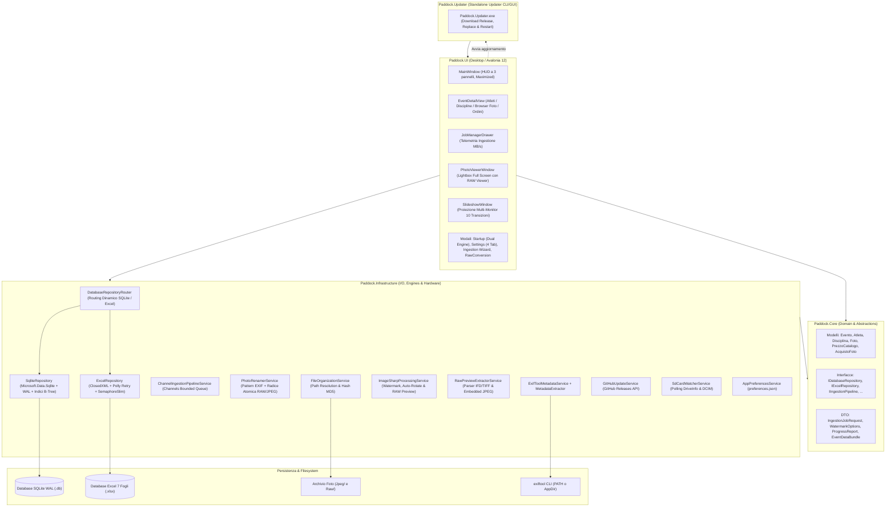
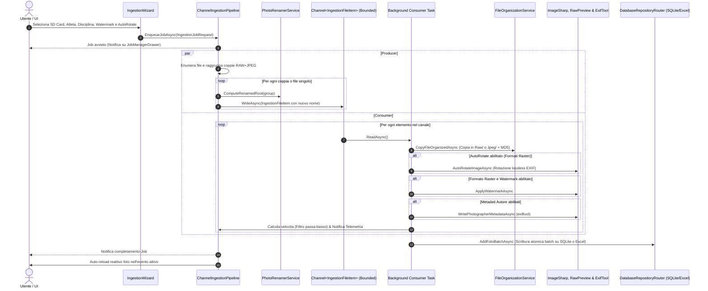

# Paddock

Applicazione desktop cross-platform ad alte prestazioni (.NET 10 + Avalonia UI v12) per fotografi professionisti di eventi sportivi, progettata per l'ingestione parallela da schede SD multiple, la ridenominazione automatica deterministica basata su metadati EXIF, l'organizzazione automatizzata dei file per Atleta e Disciplina, l'applicazione di watermark e firme nei metadati (JPEG e RAW), il browser foto gerarchico con visualizzazione diretta dei negativi digitali RAW e lightbox standalone a tutto schermo, lo strumento di conversione batch RAW $\rightarrow$ JPEG, la rotazione automatica basata su orientamento EXIF, la gestione listino prezzi e ordini clienti, la proiezione slideshow multi-monitor con 10 transizioni visive, il supporto **dual-database SQLite ad alte prestazioni (`.db`) / Excel (`.xlsx`)** con router dinamico e migrazione istantanea, e il sistema di **auto-aggiornamento integrato (`Paddock.Updater`)** basato su GitHub Releases.

---

## Panoramica

Durante eventi sportivi sul campo (gare podistiche, ciclismo, rally, triathlon, manifestazioni equestri o motociclistiche), i fotografi necessitano di scaricare contemporaneamente decine o centinaia di gigabyte di scatti da molteplici corpi macchina e lettori di schede SD, catalogando rapidamente ogni foto per partecipante e disciplina sportiva prima della consegna, vendita al desk o pubblicazione online.

I software di catalogazione convenzionali risultano spesso rigidi, impongono formati di catalogo proprietari difficilmente condivisibili e bloccano l'interfaccia utente durante i trasferimenti massivi di file.

**Paddock** risolve queste criticità offrendo:
- **Interfaccia Darkroom Professionale**: GUI ad alto contrasto a tutto schermo (`WindowState="Maximized"`), icone geometriche vettoriali pulite prive di emoji, e layout HUD a 3 pannelli per la massima produttività sul campo.
- **Architettura di Ingestione Non Bloccante**: Pipeline concorrente basata su code ad alte prestazioni (`System.Threading.Channels`), capace di gestire più schede SD in parallelo monitorando la velocità di trasferimento (con filtro passa-basso per smussare i picchi) senza congelare la UI.
- **Ridenominazione Automatica Intelligente**: Regola deterministica basata su modello fotocamera, timestamp con frazioni di secondo (centisecondi raffiche) e numero scatto originale, con calcolo univoco della radice per mantenere l'accoppiamento atomico tra file RAW e JPEG.
- **Organizzazione Fisica su Disco Deterministica**: Separazione automatica e strutturata tra formati raster (`Jpeg`) e negativi digitali proprietari (`Raw`) con percorsi relativi portabili indipendenti da lettere di unità.
- **Auto-Rotazione EXIF Intelligente**: Rilevamento automatico dell'orientamento dello scatto dai tag EXIF con rotazione lossless dei pixel durante l'ingestione, azzerando la necessità di ruotare manualmente gli scatti verticali.
- **Supporto Nativo RAW & Lightbox Full Screen**: Navigazione a 3 livelli (Evento $\rightarrow$ Atleta $\rightarrow$ Disciplina), visualizzazione diretta a schermo intero dei file RAW (`.CR2`, `.CR3`, `.NEF`, `.ARW`, ecc.) tramite estrazione streaming della preview JPEG ad alta risoluzione senza attese, zoom continuo, panning fluido ed eliminazione sincronizzata (disco + database).
- **Convertitore Batch RAW $\rightarrow$ JPEG Integrato**: Strumento dedicato (`RawConversionDialog`) per convertire massivamente negativi digitali RAW in immagini JPEG di alta qualità con profilo colore corretto, opzione watermark e registrazione automatica nel database e nelle cartelle dell'evento.
- **Architettura Dual Database (SQLite + Excel)**: Motore predefinito **SQLite ultra-performante** con WAL mode, zero-lock, indici B-Tree sub-millisecondo e scritture atomiche in batch, affiancato alla piena compatibilità con file **Microsoft Excel (`.xlsx`) a 7 fogli**. Commutazione trasparente tramite `DatabaseRepositoryRouter` e strumento di migrazione con 1 clic nelle impostazioni.
- **Gestione Listino Prezzi & Ordini Clienti (Desk Vendite)**: Listino predefinito basato su tariffe reali da volantino fotografico, creazione rapida ordini per atleta e disciplina (foto singole, cartella intera o stampe), calcolo automatico dei totali e tracciamento incassi evento.
- **Presentazione Slideshow Multi-Monitor Resiliente**: Finestra di proiezione secondaria a schermo intero con 10 transizioni visive moderne cicliche, badge HUD arricchito (evento, atleta, disciplina, foto) e fallback automatico in caso di formati particolari.
- **Sistema di Aggiornamento Automatico (`Paddock.Updater`)**: Controllo automatico o manuale di nuove versioni su GitHub Releases, notifica non invasiva in interfaccia e aggiornamento self-contained completamente automatizzato che scarica, estrae e riavvia l'applicazione.
- **Watermark Engine & Pipeline Metadati Ibrida**: Applicazione di watermark raster con simulazione live su scatto reale Canon EOS 600D, e scrittura sicura di autore e copyright anche sui file RAW proprietari tramite wrapper di processo `exiftool`.

---

## Funzionalità

### 1. Ingestione Concorrente Multi-Card (Producer/Consumer)
- Esecuzione simultanea di importazioni da percorsi o lettori SD multipli con monitoraggio di velocità di trasferimento (MB/s), percentuale di completamento, tempo residuo stimato e supporto alla cancellazione reattiva per singolo job.
- Calcolo velocità smussato tramite filtro passa-basso esponenziale (`Speed = Speed * 0.7 + Current * 0.3`).
- **Auto-Reload Reattivo**: Al completamento di un job di ingestione, la schermata dell'evento attivo ricarica automaticamente le foto e aggiorna i contatori senza alcun intervento manuale.

### 2. Ridenominazione Automatica dei File da SD
- Durante l'importazione, ogni file viene automaticamente rinominato secondo la convenzione professionale:
  ```text
  {CameraModel}_{YYYYMMDD_HHmmss}_{SubSec}_{OriginalNumber}.{ext}
  ```
  *Esempio:* `EOS600D_20261007_153022_04_4589.CR2` e `EOS600D_20261007_153022_04_4589.JPG`
- **Regole di Estrazione Metadati**:
  - `CameraModel`: estratto dal tag `Exif.Image.Model` (rimozione automatica del prefisso "Canon" e degli spazi, es. `EOS600D`, `EOS100D`).
  - `Data/Ora`: estratta da `Exif.Photo.DateTimeOriginal` nel formato `yyyyMMdd_HHmmss`.
  - `SubSec`: estratto da `Exif.Photo.SubSecTimeOriginal` (centisecondi a due cifre per distinguere raffiche al medesimo secondo; fallback su `"00"` se assente).
  - `OriginalNumber`: estratto tramite regex dalle cifre finali del nome originale del file (es. `IMG_4589` $\rightarrow$ `4589`).
  - **Coppie RAW+JPEG Atomiche**: la radice del nome viene calcolata una sola volta (ispezionando prioritariamente il JPEG) per garantire che RAW e JPEG condividano lo stesso identico identificativo prima di essere smistati nelle cartelle `Raw/` e `Jpeg/`.
  - **Fallback di Sicurezza**: se i metadati sono assenti o il file non è leggibile, viene conservato il nome file originale.

### 3. Organizzazione su File System & Percorsi Relativi Portabili
- Albero delle cartelle generato:
  ```text
  [Cartella Root] / [Nome Evento] / [Pettorale_Cognome_Nome] / [Disciplina] / [Jpeg | Raw] / [NomeFile]
  ```
- Riconoscimento automatico di 10 estensioni RAW fotografiche: `.CR2`, `.CR3`, `.NEF`, `.ARW`, `.DNG`, `.RAF`, `.RW2`, `.ORF`, `.PEF`, `.SRW`.
- **Percorsi Relativi Portabili**: I riferimenti ai file nel database sono memorizzati in forma relativa (`[Evento]\[Atleta]\[Disciplina]\[Formato]\[NomeFile]`), rendendo l'intero archivio indipendente dalla lettera di unità e facilmente spostabile su hard disk esterni o cartelle cloud.
- Struttura predefinita compatibile: cartella `..\Database\Paddock_Database.db` (o `.xlsx`) e `..\Foto\`.

### 4. Auto-Rotazione Immagini Basata su Orientamento EXIF
- Rilevamento automatico dell'orientamento dello scatto dal tag `Exif.Image.Orientation` (orientamenti 1, 3, 6, 8 per scatti portrait/verticali).
- Ruota fisicamente i pixel delle immagini JPEG in fase di ingestione e resetta il tag EXIF a 1 (normale), garantendo compatibilità visiva universale su qualsiasi visualizzatore di terze parti o pagina web.
- Opzione configurabile nelle preferenze globali e modificabile per singola importazione nel wizard SD.

### 5. Visualizzazione Nativa RAW & Convertitore RAW $\rightarrow$ JPEG
- **Visualizzazione Diretta RAW in Lightbox (`PhotoViewerWindow`)**:
  - Estrazione ad alta velocità della preview JPEG a piena risoluzione memorizzata all'interno dei negativi digitali (`.CR2`, `.CR3`, `.NEF`, `.ARW`, ecc.) tramite parser IFD/TIFF e stream scanner fallback.
  - Consente al fotografo di ispezionare a schermo intero i negativi digitali con zoom e panning istantaneo senza dover prima sviluppare o convertire i RAW.
- **Strumento di Conversione Batch RAW $\rightarrow$ JPEG (`RawConversionDialog`)**:
  - Accessibile con un clic dal dettaglio dell'evento.
  - Scansiona tutti i file RAW presenti che non hanno ancora un corrispettivo JPEG generato.
  - Mostra miniature di anteprima, dimensione dei file e consente selezione selettiva o totale.
  - Esegue la conversione multithread ad alta qualità con correzione dello spazio colore e applicazione opzionale del watermark.
  - Registra automaticamente i nuovi file JPEG nel database e nella cartella `Jpeg/` dell'atleta.

### 6. Browser Foto Gerarchico & Lightbox Full Screen
- **Struttura a 2 Tab Dedicati**:
  - **Atleti**: Raggruppamento a 3 livelli (**Evento** $\rightarrow$ **Atleta** $\rightarrow$ **Disciplina** $\rightarrow$ **Miniature Foto**), filtri formato (Tutti / JPEG / RAW), ricerca rapida per nome o pettorale e pannelli collassati di default per apertura istantanea.
  - **Premiazioni**: Scheda dedicata per scatti del podio e premiazioni (`IsPremiazione = true` o cartella `Premiazioni\`).
- **Visore Standalone Lightbox a Schermo Intero (`PhotoViewerWindow`)**:
  - Apertura con doppio clic su qualsiasi miniatura.
  - Zoom progressivo continuo con rotella del mouse, tastiera o pulsanti dedicati.
  - Panning fluido dell'immagine ingrandita tramite trascinamento (click & drag).
  - Navigazione avanti/indietro tramite frecce tastiera o Spazio/Backspace.
  - **Eliminazione Singola Sincronizzata**: Cancellazione sicura dello scatto corrente con rimozione simultanea dal database e dal disco.

### 7. Gestione Listino Prezzi & Ordini Foto (Desk Vendite)
- **Scheda Ordini & Acquisti (Tab 4)** nella schermata di dettaglio dell'evento.
- **Listino Prezzi Predefinito** basato sulle tariffe reali da volantino fotografico:
  - 1 Foto Digitale: € 6,00
  - 2 Foto Digitali: € 10,00
  - Da 3 a 5 Foto Digitali: € 15,00
  - Tutta la Cartella Digitale Atleta / Gara: € 20,00
  - Stampa Fotografica 15x20: € 5,00
  - Stampa Fotografica 20x30: € 8,00
  - Pacchetto Digitale + Stampa 15x20: € 10,00
  - Pacchetto Digitale + Stampa 20x30: € 12,00
- Creazione ordini per atleta e disciplina: selezione opzionale dell'intera cartella o di scatti specifici, aggiunta righe dal catalogo, calcolo automatico dei totali e tracciamento incassi.

### 8. Presentazione Slideshow Multi-Monitor Resiliente
- Finestra di proiezione dedicata a schermo intero (`SlideshowWindow`) per proiettori o monitor secondari esterni rivolti al pubblico.
- Selezione granulare dei partecipanti/atleti ("Seleziona tutti" / "Deseleziona tutti").
- Flag dedicato **"Visualizza premiazioni"** con badge HUD dedicato (*Premiazioni* / *Podio & Premiazioni*).
- Filtro formati indipendente ("Usa Jpeg / PNG" e "Usa RAW").
- Rilevamento automatico monitor (`Screens.All`) con preselezione dello schermo secondario se disponibile.
- Tempo di permanenza configurabile (da 2 a 30 secondi) e ordinamento casuale (Shuffle) o sequenziale.
- **10 Effetti di Transizione Visivi Moderni** (rotazione ciclica o selezione specifica):
  *Dissolvenza Incrociata*, *Scorrimento Dinamico*, *Ken Burns Cinematic*, *Zoom Esplosivo Sfumato*, *Flash Sportivo Paddock*, *Sfumatura a Tendina*, *Espansione Circolare a Iride*, *Glitch Digitale Azione*, *Mosaico a Blocchi*, *Sfocatura Direzionale Rapida*.
- **HUD Darkroom Arricchito**: Badge informativi per `[PADDOCK LIVE]`, `[Nome Evento]`, `Nome Atleta`, `[Disciplina]`, `[Nome File Foto]` e contatore scatti.
- **Fallback Resiliente Senza Transizione**: In presenza di file non standard, la presentazione esegue un fallback istantaneo senza transizione, evitando qualunque blocco dello scorrimento.

### 9. Watermark Engine & Pipeline Metadati Ibrida
- **Watermark Engine Personalizzabile**: Applicazione tramite `SixLabors.ImageSharp` su formati raster: logo PNG con ridimensionamento proporzionale (5%-80%), opacità regolabile (0-100%) e posizionamento controllato (angoli, centro).
- **Simulazione Live Watermark**: Scheda dedicata nelle Impostazioni con anteprima dal vivo renderizzata su uno scatto reale Canon EOS 600D.
- **Scrittura Metadati RAW & JPEG**: Scrittura sicura dei campi Autore (*Artist/Creator*) e Copyright tramite wrapper del processo `exiftool` con parametro `-overwrite_original`.
- **Precompilazione Automatica**: Autore e copyright configurati nelle Impostazioni vengono automaticamente precompilati nel wizard di ingestione SD.

### 10. Architettura Dual Database: SQLite ad Alte Prestazioni + Compatibilità Excel
- **Motore SQLite (`.db`, `.sqlite`, `.sqlite3`, `.db3`)**:
  - Modalità WAL (*Write-Ahead Logging*) per massimizzare la concorrenza di lettura durante le scritture.
  - Indici B-Tree dedicati (`idx_foto_evento`, `idx_foto_atleta`, `idx_foto_disciplina`, `idx_atleti_pettorale`) per ricerche e filtri istantanei su archivi con decine di migliaia di scatti.
  - Scritture batch atomiche su transazione (`tx.CommitAsync()`) per ingestione ad alta velocità.
  - Cancellazione atomica a cascata per l'eliminazione completa di eventi e dati correlati.
- **Motore Excel (`.xlsx`, `.xlsm`, `.xls`)**:
  - Strutturato a 7 fogli di calcolo (`Eventi`, `Discipline`, `Atleti`, `Foto`, `Impostazioni`, `ListinoPrezzi`, `Acquisti`).
  - Compatibile al 100% con Microsoft Excel e cartelle cloud sincronizzate (Google Drive, Dropbox, OneDrive).
  - Concorrenza protetta da lock thread-safe (`SemaphoreSlim`) e policy di retry esponenziale (`Polly`).
- **Router Dinamico (`DatabaseRepositoryRouter`)**:
  - Rileva automaticamente il formato dall'estensione del file.
  - Consente di passare istantaneamente tra SQLite ed Excel senza riavviare l'applicazione.
- **Migrazione Veloce 1-Clic da Excel a SQLite**:
  - Quando è attivo un database Excel, la schermata Impostazioni offre il pulsante **"Migra in SQLite"** che copia fedelmente tutti i dati storici (eventi, discipline, atleti, foto standard e premiazioni, listino prezzi, acquisti e impostazioni) in un nuovo database SQLite vergine e commuta l'applicazione su quest'ultimo.

### 11. Sistema di Aggiornamento Automatico Software (`Paddock.Updater`)
- **Controllo Automatico & Manuale**: Verifica tramite GitHub Releases API la disponibilità di nuove versioni (stabili o pre-release).
- **Notifica Non Invasiva**: Banner elegante nella schermata principale con pulsante rapido per visualizzare i dettagli dell'aggiornamento.
- **Scheda "Informazioni" nelle Impostazioni**: Mostra la versione corrente installata, note di rilascio ufficiali, changelog e pulsante "Aggiorna ora".
- **Eseguibile Updater Standalone (`Paddock.Updater.exe`)**: Esegue in background la chiusura sicura di Paddock, il download dell'archivio release ZIP da GitHub, l'estrazione e sovrascrittura atomica con cicli di retry, e il riavvio immediato dell'applicazione aggiornata.

---

## Architettura

Il progetto implementa i principi di **Clean Architecture** e il pattern **MVVM** (`CommunityToolkit.Mvvm`), suddiviso in 5 progetti modulari:



### Flusso Dati di Ingestione con Ridenominazione e Auto-Rotazione



---

## Tech Stack

| Componente | Tecnologia | Versione | Utilizzo nel Progetto |
|---|---|---|---|
| **Runtime & SDK** | .NET | `10.0` (C# 14) | Runtime primario di esecuzione e compilazione cross-platform |
| **Framework GUI** | Avalonia UI | `12.1.3` | Interfaccia grafica desktop nativa e reattiva basata su XAML |
| **GUI Theme & Fonts** | Avalonia.Themes.Fluent / Inter | `12.1.3` | Tema Fluent Darkroom e tipografia Inter ad alta leggibilità |
| **MVVM Toolkit** | CommunityToolkit.Mvvm | `8.4.0` | Source generators (`[ObservableProperty]`, `[RelayCommand]`) |
| **Database SQLite** | Microsoft.Data.Sqlite | `10.0.12` | Motore database relazionale primario con WAL mode e indici B-Tree |
| **Manipolazione Excel** | ClosedXML | `0.105.1` | Lettura e scrittura OpenXML su file `.xlsx` a 7 fogli |
| **Resilienza I/O** | Polly | `8.5.2` | Policy di retry esponenziale per lock concorrenti su file |
| **Image Processing** | SixLabors.ImageSharp | `3.1.12` | Decodifica immagini, ridimensionamento, watermark e auto-rotazione |
| **Image Drawing** | SixLabors.ImageSharp.Drawing | `2.1.7` | Rendering vettoriale e posizionamento grafico watermark |
| **Lettura Metadati** | MetadataExtractor | `2.9.3` | Parsing rapido EXIF/TIFF per estrazione data, SubSec e orientamento |
| **Scrittura Metadati RAW** | ExifTool CLI | Esterno / PATH / AppDir | Iniezione metadati autore e copyright su file RAW proprietari |
| **Framework di Test** | xUnit | `2.9.3` | Test runner e framework di unit/integration testing |
| **Asserzioni Test** | FluentAssertions | `6.12.2` | Asserzioni fluide e leggibili per i test |
| **Mocking** | Moq | `4.20.72` | Mocking delle interfacce di servizio nei test |
| **Coverage Collector** | coverlet.collector | `6.0.4` | Raccolta telemetria di copertura del codice |

---

## Prerequisiti

1. **.NET 10 SDK** (versione `10.0.100` o successiva). Verificare l'installazione tramite:
   ```bash
   dotnet --version
   ```
2. **Sistema Operativo**:
   - **Windows**: Windows 10 (versione 1809+) o Windows 11 (x64 / arm64).
   - **Linux**: Distribuzione Linux a 64-bit con X11 o Wayland e supporto a librerie X11/FontConfig (es. Ubuntu 22.04+, Fedora 38+).
3. **ExifTool (Opzionale ma Raccomandato)**:
   - Necessario per iniettare i campi Autore e Copyright nei file **RAW** proprietari (`.CR2`, `.CR3`, `.NEF`, `.ARW`, `.DNG`, `.RAF`, `.RW2`, `.ORF`, `.PEF`, `.SRW`).
   - Scaricabile dal sito ufficiale: posizionare l'eseguibile (`exiftool.exe` su Windows o `exiftool` su Linux) nella cartella dell'applicazione accanto a `Paddock.UI.exe`, oppure aggiungerlo al `PATH` di sistema. In assenza di ExifTool, l'ingestione procede regolarmente notificando l'utente.

---

## Installazione

1. Clonare il repository:
   ```bash
   git clone https://github.com/zmalrobot/Paddock.git
   cd PhotoOrganizer
   ```

2. Ripristinare i pacchetti NuGet per l'intera soluzione:
   ```bash
   dotnet restore Paddock.sln
   ```

---

## Configurazione

### 1. File di Preferenze Applicazione (`preferences.json`)

Memorizzato localmente nel percorso:
- **Windows**: `%APPDATA%\Paddock\preferences.json`
- **Linux**: `~/.config/Paddock/preferences.json`

| Proprietà | Tipo | Descrizione | Valore di Default |
|---|---|---|---|
| `LastDatabasePath` | `string?` | Percorso dell'ultimo database aperto (relativo o assoluto) | `null` (ricade su `..\Database\Paddock_Database.db`) |
| `RecentDatabases` | `string[]` | Elenco storico dei database aperti di recente (fino a 10) | `[]` |
| `AutoOpenLastDatabase` | `boolean` | Se `true`, salta la finestra di selezione database all'avvio | `false` |
| `CheckUpdatesOnStartup` | `boolean` | Controlla automaticamente la presenza di nuove versioni all'avvio | `true` |
| `DefaultAutoRotate` | `boolean` | Abilita la rotazione automatica basata sui tag EXIF di orientamento | `true` |
| `DefaultPhotographerName` | `string` | Nome fotografo predefinito per il wizard di ingestione | `""` |
| `DefaultCopyrightNotice` | `string` | Avviso copyright predefinito per il wizard di ingestione | `""` |
| `DefaultWatermarkEnabled` | `boolean` | Abilitazione predefinita del watermark nell'ingestione | `false` |
| `DefaultWatermarkImagePath` | `string` | Percorso predefinito del logo PNG del watermark | `""` |
| `DefaultWatermarkPosition` | `string` | Posizione predefinita del watermark (`BottomRight`, ecc.) | `"BottomRight"` |
| `DefaultWatermarkOpacity` | `double` | Opacità predefinita del watermark (0.0 - 1.0) | `0.85` |
| `DefaultWatermarkScalePercent` | `int` | Scala percentuale predefinita del watermark (5 - 80) | `25` |

### 2. Finestra Impostazioni a 4 Schede (Header Applicazione)

Dall'header dell'applicazione è possibile aprire la finestra di configurazione organizzata in 4 schede:
1. **Database & Archivio**:
   - Visualizzazione del database attivo con badge del motore (`[SQLITE]` o `[EXCEL]`).
   - Pulsanti rapidi: **"Sfoglia Archivio..."**, **"Nuovo SQLite..."** e **"Nuovo Excel..."**.
   - **Migrazione Veloce a SQLite**: Quando è aperto un file Excel, consente con un solo clic di creare una copia in formato SQLite e commutare l'applicazione sul nuovo database performante.
   - Modifica del `BasePath` e aggiornamento atomico dei percorsi di tutti gli eventi.
2. **Catalogo Prezzi**: Visualizzazione, modifica, aggiunta o cancellazione delle voci del listino prezzi, con pulsante per il ripristino istantaneo del listino ufficiale da volantino.
3. **Watermark & Metadati**: Configurazione del logo PNG, della scala, dell'opacità e della posizione, con simulazione live renderizzata su un vero scatto Canon EOS 600D, e impostazione permanente di Autore e Copyright.
4. **Informazioni**: Visualizzazione versione corrente, verifica della presenza di aggiornamenti su GitHub Releases, note di rilascio, pulsante di aggiornamento automatico con `Paddock.Updater` e versioni dei singoli moduli.

---

## Utilizzo

### 1. Selezione o Creazione del Database all'Avvio
All'avvio compare la schermata di selezione:
- **⚡ Continua con l'ultimo database**: Apre direttamente l'ultimo database `.db` o `.xlsx` utilizzato.
- **🚀 Nuovo SQLite (.db)...**: *(Consigliato)* Crea un nuovo database SQLite ad alte prestazioni per massimizzare la velocità di ricerca e catalogazione.
- **📊 Vecchio Excel (.xlsx)...**: Crea un database compatibile con Microsoft Excel OpenXML.
- **📂 Apri Esistente**: Collega un database già esistente (supporta `.db`, `.sqlite`, `.sqlite3`, `.db3`, `.xlsx`).

### 2. Gestione Eventi, Atleti, Discipline e Ordini
1. Fare clic su **Nuovo Evento** nella barra laterale sinistra per registrare una gara o manifestazione (Nome, Date, Luogo, Cartella Root di destinazione).
2. Selezionare l'evento per accedere al workspace:
   - **Scheda Atleti**: Censire i concorrenti con Numero di Pettorale, Cognome, Nome e Categoria.
   - **Scheda Discipline**: Definire le discipline dell'evento (es. *Nuoto*, *Ciclismo*, *Corsa*, *Podio*).
   - **Scheda Browser Foto**: Visualizzare le foto catalogate raggruppate per Atleta e Disciplina (collassate di default). Filtrare per nome o numero di pettorale. Doppio clic su una foto per aprirla nel visore lightbox a schermo intero con zoom continuo.
   - **Scheda Gestione Ordini & Acquisti**: Registrare ordini al desk selezionando l'atleta, la disciplina, le singole foto o l'intera cartella. Aggiungere voci dal catalogo e monitorare gli incassi.

### 3. Ingestione da Schede SD
1. Premere il pulsante **Ingestione SD** nella schermata dell'evento.
2. Nella finestra modale:
   - Selezionare l'unità rimovibile rilevata in automatico o sfogliare una cartella di origine.
   - Associare l'**Atleta** e la **Disciplina** di destinazione (o spuntare **Premiazioni** per foto del podio).
   - Spuntare **Rotazione Automatica** per orientare automaticamente gli scatti verticali.
   - Verificare le opzioni di **Watermark** e **Metadati** (già precompilate dalle impostazioni).
3. Premere **Avvia Ingestione**: il lavoro viene accodato e il cassetto inferiore **Job Manager** mostra progresso e velocità in MB/s. Al termine, il Browser Foto si aggiorna automaticamente.

### 4. Conversione Batch RAW $\rightarrow$ JPEG
1. Nella schermata di dettaglio dell'evento, fare clic sul pulsante **Converti RAW in JPEG**.
2. Il dialog visualizza l'elenco di tutti i negativi digitali privi di file JPEG associato, con anteprime visive generate al volo.
3. Selezionare le foto desiderate e avviare la conversione: i file JPEG vengono generati con profilo colore fedele, opzione watermark applicata e registrati nel database.

### 5. Presentazione Slideshow Multi-Monitor
1. Premere **Avvia Presentazione** nell'header dell'evento.
2. Configurare lo schermo di proiezione (es. secondo monitor o videoproiettore), gli atleti partecipanti, le transizioni desiderate (scelta tra 10 effetti visivi o rotazione ciclica) e la durata delle diapositive.
3. Avviare la presentazione: la finestra a schermo intero visualizzerà le foto con badge HUD informativo in sovrimpressione. Premere `ESC` sulla presentazione o **Interrompi Presentazione** per terminare.

---

## Specifiche dei Database

### 1. Database SQLite (`.db`)
Il motore SQLite utilizza uno schema relazionale ottimizzato con indici B-Tree:
- **`Eventi`**: `Id` (PK), `NomeEvento`, `DataInizio`, `DataFine`, `Luogo`, `CartellaDestinazioneRoot`, `Note`, `DataCreazione`.
- **`Discipline`**: `Id` (PK), `EventoId`, `NomeDisciplina`, `Descrizione`. Indice: `idx_discipline_evento`.
- **`Atleti`**: `Id` (PK), `EventoId`, `NumeroPettorale`, `Nome`, `Cognome`, `Categoria`, `Note`, `TimestampIngestione`. Indici: `idx_atleti_evento`, `idx_atleti_pettorale`.
- **`Foto`**: `Id` (PK), `EventoId`, `AtletaId`, `DisciplinaId`, `NomeFileOriginale`, `PathRelativo`, `Formato`, `DataScatto`, `Fotografo`, `WatermarkApplicato`, `DimensioneByte`, `HashMd5`, `IsPremiazione`. Indici: `idx_foto_evento`, `idx_foto_atleta`, `idx_foto_disciplina`, `idx_foto_evento_atleta`.
- **`ListinoPrezzi`**: `Id` (PK), `Categoria`, `Nome`, `Prezzo`, `QuantitaFoto`, `Descrizione`.
- **`Acquisti`**: `Id` (PK), `EventoId`, `DataAcquisto`, `AtletaId`, `NomeAtleta`, `NumeroPettorale`, `DisciplinaId`, `NomeDisciplina`, `TotaleQuantita`, `TotaleCalcolato`, `TotalePagato`, `EmailCliente`, `TelefonoCliente`, `InteraCartella`, `FileFotoSelezionate`, `CartellaPathRiferimento`, `VociJson`, `VociSommario`, `Note`, `Stato`. Indice: `idx_acquisti_evento`.
- **`Impostazioni`**: `Chiave` (PK), `Valore`, `Descrizione`, `DataModifica`.

### 2. Database Excel a 7 Fogli (`.xlsx`)
Per la massima interoperabilità esterna con fogli di calcolo, la struttura Excel riflette i medesimi dati suddivisi in 7 fogli: `Eventi`, `Discipline`, `Atleti`, `Foto`, `Impostazioni`, `ListinoPrezzi`, `Acquisti`.

---

## Compilazione e Build

### Compilazione Standard
```bash
dotnet build Paddock.sln
```

### Compilazione Release Ottimizzata
```bash
dotnet build Paddock.sln -c Release
```

### Pubblicazione Eseguibile Standalone (Self-Contained)

Per Windows x64:
```bash
dotnet publish src/Paddock.UI/Paddock.UI.csproj -c Release -r win-x64 --self-contained -p:PublishSingleFile=true
```

Per Linux x64:
```bash
dotnet publish src/Paddock.UI/Paddock.UI.csproj -c Release -r linux-x64 --self-contained -p:PublishSingleFile=true
```

---

## Test

Il progetto include una suite completa di **161 test unitari e di integrazione** basati su **xUnit**, **FluentAssertions** e **Moq**, tutti verificati e con esito positivo al 100%.

### Esecuzione di tutti i test
```bash
dotnet test Paddock.sln -c Release
```

Output atteso:
```text
Passed!  - Failed:     0, Passed:   161, Skipped:     0, Total:   161
```

### Suddivisione della Suite di Test (11 File)

| File di Test | Casi di Test | Argomenti e Funzionalità Coperte |
|---|---|---|
| `PhotoRenamerServiceTests.cs` | **15 test** | Pulizia e sanitizzazione modello fotocamera (rimozione "Canon" e spazi), estrazione centisecondi SubSec raffiche, regex numero scatto originale, pattern completo `{CameraModel}_{YYYYMMDD_HHmmss}_{SubSec}_{OriginalNumber}`, fallback di sicurezza a nome originale. |
| `ExcelRepositoryTests.cs` | **11 test** | Inizializzazione 7 fogli obbligatori, bundle atomico `GetEventDataBundleAsync`, persistenza ListinoPrezzi e Acquisti, operazioni CRUD, gestione concorrenza multi-thread e percorsi relativi portabili. |
| `SqliteRepositoryTests.cs` | **8 test** | Inizializzazione DDL e indici SQLite, operazioni CRUD, scritture batch su transazione, inserimento foto Premiazioni e orfane senza vincoli bloccanti, cancellazione atomica a cascata. |
| `DatabaseRepositoryRouterTests.cs` | **3 test** | Rilevamento automatico dell'engine da estensione file, commutazione dinamica a runtime tra `.db` e `.xlsx`, migrazione atomica fedele da Excel a SQLite con acquisti e foto premiazioni. |
| `ChannelIngestionPipelineTests.cs` | **3 test** | Ingestione parallela bounded Channel end-to-end, ridenominazione atomica e condivisa per coppie RAW+JPEG con smistamento cartelle, cancellazione reattiva dei job tramite `CancellationToken`. |
| `FileOrganizationServiceTests.cs` | **11 test** | Riconoscimento delle 10 estensioni RAW e dei formati raster, sanitizzazione percorsi, alberatura directory e calcolo checksum MD5. |
| `ImageProcessingServiceTests.cs` | **4 test** | Rilevamento orientamento EXIF (tag 1, 3, 6, 8), rotazione lossless delle immagini verticali, reset del tag di orientamento a 1 e preservazione dei file RAW proprietari. |
| `RawConversionTests.cs` | **4 test** | Conversione da negativi digitali RAW in JPEG ad alta qualità, correzione spazio colore, gestione eccezioni per file inesistenti e selezione nel dialog viewmodel. |
| `RawPreviewExtractorTests.cs` | **12 test** | Rilevamento formati RAW (`.CR2`, `.CR3`, `.NEF`, `.ARW`, ecc.), estrazione JPEG embedded a piena risoluzione, fallback a stream scanner, miniature veloci e visualizzazione lightbox. |
| `UpdateServiceTests.cs` | **7 test** | Parsing versioni semantiche, interrogazione GitHub Releases API, compatibilità pre-release e download asset di aggiornamento. |
| `ViewModelTests.cs` | **83 test** | Validazione e logica di tutti i ViewModel: Main, EventDetail, IngestionWizard, Settings (4 tab), Slideshow (10 transizioni e HUD), PhotoViewer, StartupDialog, eliminazione sicura. |

### Esecuzione con filtro per specifica suite
```bash
dotnet test Paddock.sln --filter "FullyQualifiedName~SqliteRepositoryTests"
dotnet test Paddock.sln --filter "FullyQualifiedName~DatabaseRepositoryRouterTests"
dotnet test Paddock.sln --filter "FullyQualifiedName~UpdateServiceTests"
dotnet test Paddock.sln --filter "FullyQualifiedName~RawPreviewExtractorTests"
dotnet test Paddock.sln --filter "FullyQualifiedName~RawConversionTests"
```

---

## Release e Packaging

La compilazione e distribuzione degli archivi standalone è automatizzata tramite GitHub Actions ed eseguibile in modalità manuale (`workflow_dispatch`).

### 1. Workflow GitHub Actions (`.github/workflows/release.yml`)
- **Runner Windows** (`windows-latest`): compila e impacchetta la versione per Windows x64 con icona incorporata (`paddock.ico`).
- **Runner Linux** (`ubuntu-latest`): compila e impacchetta la versione per Linux x64 con permessi POSIX eseguibili.
- **Creazione Automatica GitHub Release**: Pubblica ufficialmente la release con tag semantico (es. `v0.6.0`) allegando i pacchetti ZIP direttamente alla pagina Releases di GitHub.

### 2. Packaging Locale
È possibile creare i pacchetti anche localmente con gli script forniti:
- **Su Windows (PowerShell)**:
  ```powershell
  ./scripts/build-windows.ps1 -Version "0.6.0"
  ```
  Genera: `artifacts/Paddock-0.6.0-windows-x64.zip`
- **Su Linux (Bash)**:
  ```bash
  chmod +x ./scripts/build-linux.sh
  ./scripts/build-linux.sh "0.6.0"
  ```
  Genera: `artifacts/Paddock-0.6.0-linux-x64.zip`

---

## Struttura del Progetto

```text
PhotoOrganizer/
├── .github/
│   └── workflows/
│       └── release.yml           # Workflow GitHub Actions per release e pubblicazione pacchetti
├── .vscode/
│   └── settings.json             # Configurazione ambiente VS Code
├── scripts/
│   ├── build-windows.ps1         # Script packaging self-contained per Windows (win-x64) con icona
│   ├── build-linux.ps1           # Script packaging PowerShell per Linux
│   └── build-linux.sh            # Script packaging Bash per Linux (linux-x64)
├── src/
│   ├── Paddock.Core/             # Dominio puro e astrazioni (Nessuna dipendenza esterna I/O)
│   │   ├── DTOs/                 # DTO per Ingestione, Watermark, Metadati, Bundle Evento, Update
│   │   ├── Enums/                # FormatoFoto, WatermarkPosition, IngestionStatus, DeleteMode, CategoriaPrezzo
│   │   ├── Interfaces/           # Interfacce (IDatabaseRepository, IExcelRepository, IIngestionPipeline, ...)
│   │   ├── Models/               # Modelli (Evento, Disciplina, Atleta, Foto, PrezzoCatalogo, AcquistoFoto)
│   │   └── Paddock.Core.csproj
│   │
│   ├── Paddock.Infrastructure/   # Implementazione servizi di persistenza, hardware e processing
│   │   ├── Configuration/        # Preferenze locali (AppPreferencesService)
│   │   ├── Excel/                # Repository ClosedXML (7 fogli) con retry Polly e SemaphoreSlim
│   │   ├── Hardware/             # Rilevamento rimovibili SD / DCIM (SdCardWatcherService)
│   │   ├── ImageProcessing/      # Watermark, anteprime live, auto-rotazione, estrazione RAW preview
│   │   ├── Ingestion/            # Pipeline asincrona Producer/Consumer su System.Threading.Channels
│   │   ├── Metadata/             # PhotoRenamerService, wrapper ExifTool e MetadataExtractor
│   │   ├── Services/             # DatabaseRepositoryRouter, GitHubUpdateService
│   │   ├── Sqlite/               # Repository SQLite con WAL mode e indici B-Tree
│   │   ├── Storage/              # Strutturazione cartelle e calcolo checksum MD5
│   │   └── Paddock.Infrastructure.csproj
│   │
│   ├── Paddock.UI/               # Interfaccia grafica Avalonia Desktop (MVVM)
│   │   ├── Assets/               # Risorsa incorporata logo.jpg e paddock.ico
│   │   ├── Converters/           # ValueConverters XAML
│   │   ├── ViewModels/           # Main, EventDetail, JobManager, PhotoViewer, Slideshow, Dialoghi
│   │   │   └── PhotoBrowserModels.cs # Modelli gerarchici Atleta/Disciplina con lazy loading miniature
│   │   ├── Views/                # Viste XAML (MainWindow, EventDetailView, PhotoViewerWindow, SlideshowWindow, ...)
│   │   ├── App.axaml             # Stili globali Darkroom e palette colori
│   │   ├── app.manifest          # Manifest Windows
│   │   ├── Program.cs            # Entry point dell'applicazione Avalonia
│   │   └── Paddock.UI.csproj
│   │
│   └── Paddock.Updater/          # Strumento autonomo per l'applicazione degli aggiornamenti software
│       ├── Assets/               # Icona eseguibile updater
│       ├── Program.cs            # Logica di arresto, download release ZIP, sovrascrittura e riavvio
│       └── Paddock.Updater.csproj
│
├── tests/
│   └── Paddock.Tests/            # Suite completa di 161 test xUnit
│       ├── ChannelIngestionPipelineTests.cs
│       ├── DatabaseRepositoryRouterTests.cs
│       ├── ExcelRepositoryTests.cs
│       ├── FileOrganizationServiceTests.cs
│       ├── ImageProcessingServiceTests.cs
│       ├── PhotoRenamerServiceTests.cs
│       ├── RawConversionTests.cs
│       ├── RawPreviewExtractorTests.cs
│       ├── SqliteRepositoryTests.cs
│       ├── UpdateServiceTests.cs
│       ├── ViewModelTests.cs
│       └── Paddock.Tests.csproj
│
├── .gitignore                    # Regole di esclusione Git per .NET 10, build ed OS
├── logo.jpg                      # Immagine master del logo ufficiale
├── Paddock.sln                   # Soluzione primaria .NET 10
├── Paddock.slnx                  # Soluzione formato XML moderno
└── README.md                     # Documentazione tecnica del progetto
```

---

## Risoluzione dei Problemi

### 1. File Excel Bloccato da un'Altra Applicazione (`LockContention`)
- **Causa**: Il file `.xlsx` è aperto in Microsoft Excel in modalità esclusiva o è temporaneamente bloccato dal client di sincronizzazione Google Drive / OneDrive.
- **Comportamento**: Paddock esegue fino a 5 tentativi di accesso con backoff esponenziale tramite `Polly`. Se il file rimane bloccato, compare un banner arancione non bloccante nella barra superiore.
- **Risoluzione Consigliata**: Passare a **SQLite** utilizzando la funzione "Migra in SQLite" nelle Impostazioni: SQLite non soffre di blocchi esclusivi dell'interfaccia e garantisce prestazioni nettamente superiori.

### 2. Metadati Autore non Scritti sui File RAW Proprietari
- **Causa**: `exiftool` non è installato nel sistema né presente nella directory dell'applicazione.
- **Risoluzione**: Collocare l'eseguibile di ExifTool (`exiftool.exe` su Windows o `exiftool` su Linux) direttamente nella cartella dell'eseguibile di Paddock, oppure aggiungerlo al `PATH` di sistema.

### 3. BasePath non Trovato o Lettera di Unità Modificata
- **Causa**: L'archivio delle foto risiede su un disco esterno o pendrive che ha cambiato lettera di unità (es. da `D:\` a `E:\`).
- **Risoluzione**: Aprire **Impostazioni**, scheda **Database & Archivio**, inserire il nuovo percorso in **BasePath Archivio Foto** e premere **Aggiorna BasePath nel Database**.

---

## Sviluppo e Linee Guida

- **Separazione dei Compiti**: Il progetto `Paddock.Core` non contiene alcuna dipendenza verso `Paddock.Infrastructure` o `Paddock.UI`.
- **Operazioni I/O Non Bloccanti**: Tutte le operazioni di scrittura e copia file passano attraverso `System.Threading.Channels` o metodi asincroni che accettano un `CancellationToken`. Nessuna operazione I/O pesante viene eseguita sul thread UI.
- **Darkroom UI Guidelines**: Nessuna emoji nell'interfaccia utente; tutti i comandi e pulsanti utilizzano icone geometriche o etichette testuali ad alto contrasto.

---

## Licenza

Non specificata. Consultare l'autore o il proprietario del repository per informazioni relative ai diritti di utilizzo e distribuzione.
