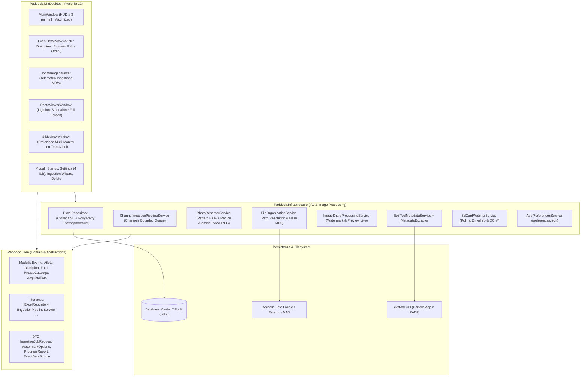
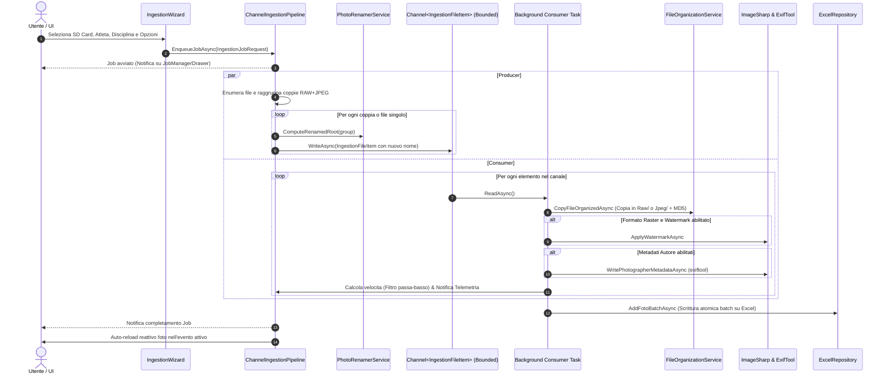

# Paddock

Applicazione desktop cross-platform ad alte prestazioni (.NET 10 + Avalonia UI) per fotografi professionisti di eventi sportivi, progettata per l'ingestione parallela da schede SD multiple, la ridenominazione automatica deterministica basata su metadati EXIF, l'organizzazione automatizzata dei file per Atleta e Disciplina, l'applicazione di watermark e firme nei metadati (JPEG e RAW), il browser foto gerarchico con lightbox standalone a schermo intero, la gestione listino prezzi e ordini clienti, la proiezione slideshow multi-monitor con 10 transizioni visive e la persistenza dei dati sincronizzata su singolo foglio di calcolo Excel (`.xlsx`).

---

## Panoramica

Durante eventi sportivi sul campo (gare podistiche, ciclismo, rally, triathlon, manifestazioni equestri o motociclistiche), i fotografi necessitano di scaricare contemporaneamente decine o centinaia di gigabyte di scatti da molteplici corpi macchina e lettori di schede SD, catalogando rapidamente ogni foto per partecipante e disciplina sportiva prima della consegna, vendita al desk o pubblicazione online.

I software di catalogazione convenzionali risultano spesso rigidi, impongono formati di catalogo proprietari difficilmente condivisibili e bloccano l'interfaccia utente durante i trasferimenti massivi di file.

**Paddock** risolve queste criticità offrendo:
- **Interfaccia Darkroom Professionale**: GUI ad alto contrasto a tutto schermo (`WindowState="Maximized"`), icone geometriche vettoriali pulite prive di emoji, e layout HUD a 3 pannelli per la massima produttività sul campo.
- **Architettura di Ingestione Non Bloccante**: Pipeline concorrente basata su code ad alte prestazioni (`System.Threading.Channels`), capace di gestire più schede SD in parallelo monitorando la velocità di trasferimento (con filtro passa-basso per smussare i picchi) senza congelare la UI.
- **Ridenominazione Automatica Intelligente**: Regola deterministica basata su modello fotocamera, timestamp con frazioni di secondo (centisecondi raffiche) e numero scatto originale, con calcolo univoco della radice per mantenere l'accoppiamento atomico tra file RAW e JPEG.
- **Organizzazione Fisica su Disco Deterministica**: Separazione automatica e strutturata tra formati raster (`Jpeg`) e negativi digitali proprietari (`Raw`) con percorsi relativi portabili indipendenti da lettere di unità.
- **Browser Foto Gerarchico & Lightbox Full Screen**: Navigazione a 3 livelli (Evento $\rightarrow$ Atleta $\rightarrow$ Disciplina) con pannelli collassati di default, filtro istantaneo per nome o numero di pettorale, caricamento asincrono virtualizzato delle miniature, auto-reload al termine dell'ingestione e visore standalone a schermo intero con zoom continuo, panning ed eliminazione sincronizzata (disco + database).
- **Gestione Listino Prezzi & Ordini Clienti (Desk Vendite)**: Listino predefinito da volantino fotografico reale, creazione rapida ordini per atleta e disciplina (foto singole, cartella intera o stampe), calcolo automatico dei totali e tracciamento incassi evento.
- **Presentazione Slideshow Multi-Monitor Resiliente**: Finestra di proiezione secondaria a schermo intero con 10 transizioni visive moderne cicliche, badge HUD arricchito con nome della foto, atleta, evento e disciplina, e fallback automatico "senza transizione" in caso di formati particolari per garantire uno scorrimento ininterrotto.
- **Database Excel Resiliente a 7 Fogli**: Persistenza trasparente e portabile su singolo file Microsoft Excel (`.xlsx`), compatibile con cartelle sincronizzate su Google Drive, Dropbox e OneDrive, gestita con retry esponenziale (`Polly`), lock thread-safe (`SemaphoreSlim`) e caricamento bundle ad alte prestazioni.
- **Watermark Engine & Pipeline Metadati Ibrida**: Applicazione di watermark raster con simulazione live su scatto reale Canon EOS 600D, e scrittura sicura di autore e copyright anche sui file RAW proprietari tramite wrapper di processo `exiftool`.

---

## Funzionalità

### 1. Ingestione Concorrente Multi-Card (Producer/Consumer)
- Esecuzione simultanea di importazioni da percorsi o lettori SD multipli con monitoraggio di velocità di trasferimento (MB/s), percentuale di completamento, tempo residuo stimato e supporto alla cancellazione reattiva per singolo job.
- Calcolo velocità smussato tramite filtro passa-basso esponenziale (`Speed = Speed * 0.7 + Current * 0.3`).
- **Auto-Reload Reattivo**: Al completamento di un job di ingestione, la schermata dell'evento attivo ricarica automaticamente le foto e aggiorna i contatori senza alcun intervento manuale.

### 2. Ridenominazione Automatica dei File da SD
- Durante l'importazione, ogni file viene automaticamente rinominato secondo la convenzione professionale:
  ```text
  {CameraModel}_{YYYYMMDD_HHmmss}_{SubSec}_{OriginalNumber}.{ext}
  ```
  *Esempio:* `EOS600D_20261007_153022_04_4589.CR2` e `EOS600D_20261007_153022_04_4589.JPG`
- **Regole di Estrazione Metadati**:
  - `CameraModel`: estratto dal tag `Exif.Image.Model` (rimozione automatica del prefisso "Canon" e degli spazi, es. `EOS600D`, `EOS100D`).
  - `Data/Ora`: estratta da `Exif.Photo.DateTimeOriginal` nel formato `yyyyMMdd_HHmmss`.
  - `SubSec`: estratto da `Exif.Photo.SubSecTimeOriginal` (centisecondi a due cifre per distinguere raffiche al medesimo secondo; fallback su `"00"` se assente).
  - `OriginalNumber`: estratto tramite regex dalle cifre finali del nome originale del file (es. `IMG_4589` $\rightarrow$ `4589`).
  - **Coppie RAW+JPEG Atomiche**: la radice del nome viene calcolata una sola volta (ispezionando prioritariamente il JPEG) per garantire che RAW e JPEG condividano lo stesso identico identificativo prima di essere smistati nelle cartelle `Raw/` e `Jpeg/`.
  - **Fallback di Sicurezza**: se i metadati sono assenti o il file non è leggibile, viene conservato il nome file originale.

### 3. Organizzazione Automatica su File System
- Albero delle cartelle generato:
  ```text
  [Cartella Root] / [Nome Evento] / [Pettorale_Cognome_Nome] / [Disciplina] / [Jpeg | Raw] / [NomeFile]
  ```
- Riconoscimento automatico di 10 estensioni RAW fotografiche: `.CR2`, `.CR3`, `.NEF`, `.ARW`, `.DNG`, `.RAF`, `.RW2`, `.ORF`, `.PEF`, `.SRW`.
- Sanitizzazione automatica dei caratteri non consentiti nei percorsi di sistema (con fallback a `Generale` o `Atleta_Sconosciuto`).
- Verifica di integrità tramite calcolo hash MD5 per ciascun file copiato.

### 4. Browser Foto a Doppio Tab & Lightbox Standalone
- **Struttura a 2 Tab Dedicati**:
  - **Atleti**: Raggruppamento strutturato a 3 livelli (**Evento** $\rightarrow$ **Atleta** $\rightarrow$ **Disciplina** $\rightarrow$ **Miniature Foto**), filtri formato (Tutti / JPEG / RAW), casella di ricerca rapida atleta per nome o pettorale e pannelli collassati di default per avvio istantaneo.
  - **Premiazioni**: Scheda dedicata che visualizza tutte le foto delle premiazioni e del podio senza filtri, con conteggio rapido e pulsante di aggiornamento.
- **Visore Standalone Lightbox a Schermo Intero (`PhotoViewerWindow`)**:
  - Apertura rapida con doppio clic su qualsiasi miniatura o pulsante dedicato (sia per foto atleti che premiazioni).
  - Zoom progressivo continuo con rotella del mouse, pulsanti dedicati zoom +/- e centratura/reset.
  - Panning fluido dell'immagine ingrandita tramite trascinamento con il mouse (click & drag).
  - Navigazione rapida avanti/indietro tramite frecce tastiera, Spazio/Backspace o pulsanti a schermo.
  - **Eliminazione Singola Sincronizzata**: Rimozione sicura della foto corrente con cancellazione simultanea del record dal database Excel e del file fisico da disco, con riallineamento immediato dei contatori evento.

### 5. Gestione Listino Prezzi & Ordini Foto (Desk Vendite Evento)
- **Scheda Ordini & Acquisti (Tab 4)** nella schermata di dettaglio dell'evento.
- **Listino Prezzi Predefinito** basato sulle tariffe reali da volantino per fotografia sportiva:
  - 1 Foto Digitale: € 6,00
  - 2 Foto Digitali: € 10,00
  - Da 3 a 5 Foto Digitali: € 15,00
  - Tutta la Cartella Digitale Atleta / Gara: € 20,00
  - Stampa Fotografica 15x20: € 5,00
  - Stampa Fotografica 20x30: € 8,00
  - Pacchetto Digitale + Stampa 15x20: € 10,00
  - Pacchetto Digitale + Stampa 20x30: € 12,00
- Creazione e registrazione ordini per atleta e disciplina: selezione opzionale dell'intera cartella o di specifiche foto, aggiunta righe ordine dal catalogo, calcolo automatico dei totali e tracciamento incassi complessivi dell'evento.
- Persistenza dettagliata delle voci d'ordine in formato JSON nel foglio `Acquisti` del database.

### 6. Presentazione Slideshow Multi-Monitor Resiliente
- Finestra di proiezione dedicata a schermo intero (`SlideshowWindow`) per proiettori o monitor secondari esterni rivolti al pubblico.
- Selezione granulare dei partecipanti/atleti con pulsanti rapidi "Seleziona tutti" e "Deseleziona tutti".
- Flag dedicato **"Visualizza premiazioni"**: include sia le foto delle premiazioni registrate a catalogo sia i file presenti nella cartella `[Evento]/Premiazioni`, con badge HUD dedicato (*Premiazioni* / *Podio & Premiazioni*).
- Filtro formati indipendente e combinabile ("Usa Jpeg / PNG" e "Usa RAW").
- Rilevamento automatico monitor (`Screens.All`) con preselezione dello schermo secondario se disponibile.
- Tempo di permanenza configurabile (da 2 a 30 secondi) e ordinamento casuale (Shuffle) o sequenziale.
- **10 Effetti di Transizione Visivi Moderni** (rotazione ciclica o selezione specifica):
  *Dissolvenza Incrociata*, *Scorrimento Dinamico*, *Ken Burns Cinematic*, *Zoom Esplosivo Sfumato*, *Flash Sportivo Paddock*, *Sfumatura a Tendina*, *Espansione Circolare a Iride*, *Glitch Digitale Azione*, *Mosaico a Blocchi*, *Sfocatura Direzionale Rapida*.
- **HUD Darkroom Arricchito**: Badge informativi inferiori ad alto contrasto per `[PADDOCK LIVE]`, `[Nome Evento]`, `Nome Atleta` (o `Premiazioni`), `[Disciplina]`, `[Nome File Foto]` e contatore scatti.
- **Fallback Resiliente Senza Transizione**: In presenza di file non standard, errori di rendering o problemi grafici, la presentazione esegue un fallback istantaneo senza transizione, evitando qualunque blocco o freeze dello scorrimento.
- Decodifica streaming non bloccante testata su archivi con centinaia di fotografie.

### 7. Watermark Engine & Pipeline Metadati Ibrida
- **Watermark Engine Personalizzabile**: Applicazione tramite `SixLabors.ImageSharp` su formati raster (`.jpg`, `.jpeg`, `.png`, `.bmp`, `.webp`): logo PNG con ridimensionamento proporzionale calcolato tra il 5% e l'80% dell'immagine, opacità regolabile (0-100%) e posizionamento controllato (angoli, centro).
- **Simulazione Live Watermark**: Scheda dedicata nelle Impostazioni con anteprima dal vivo renderizzata su uno scatto reale Canon EOS 600D.
- **Scrittura Metadati RAW & JPEG**: Scrittura sicura dei campi Autore (*Artist/Creator*) e Copyright tramite wrapper del processo `exiftool` con parametro `-overwrite_original`.
- **Precompilazione Automatica**: Autore e copyright configurati nelle Impostazioni vengono automaticamente precompilati nel wizard di ingestione SD.

### 8. Database Excel Resiliente & Portabilità
- Persistenza su singolo file `.xlsx` strutturato a **7 fogli**, gestita tramite `ClosedXML`.
- Percorsi relativi standardizzati (`[NomeEvento]\[Atleta]\[Disciplina]\[Formato]\[NomeFile]`), rendendo l'archivio indipendente da lettere di unità o percorsi assoluti.
- **Caricamento a Bundle Ad Alte Prestazioni (`GetEventDataBundleAsync`)**: Lettura batch atomica di tutti i fogli dell'evento in un'unica apertura del file Excel, eliminando il sovraccarico I/O di aperture sequenziali multiple.
- Concorrenza thread-safe (`SemaphoreSlim`) e policy di retry esponenziale (`Polly`) contro i lock temporanei causati da Excel o sincronizzatori cloud (Google Drive, OneDrive, Dropbox).

### 9. Interfaccia Utente "Pro Darkroom"
- Avvio dell'applicazione a tutto schermo (`WindowState="Maximized"`).
- Tema scuro a basso contrasto da studio fotografico (`#121316`, `#16181C`, `#22252B`), accenti arancio Paddock (`#FF8C32`) e ciano (`#00B4D8`).
- **Standardizzazione Icone UI e Zero Emoji**: Rimozione totale delle emoji in tutti i controlli a favore di icone vettoriali geometriche e badge darkroom uniformi.
- Tipografia delle schede `TabItem` ottimizzata con layout su riga singola e scorrimento orizzontale automatico.

---

## Architettura

Il progetto implementa i principi di **Clean Architecture** e il pattern **MVVM** (`CommunityToolkit.Mvvm`), suddiviso in 4 progetti:



### Flusso Dati di Ingestione con Ridenominazione Atomica



---

## Tech Stack

| Componente | Tecnologia | Versione | Utilizzo nel Progetto |
|---|---|---|---|
| **Runtime & SDK** | .NET | `10.0` (C# 14) | Runtime di esecuzione e compilazione della soluzione |
| **Framework GUI** | Avalonia UI | `12.1.3` | Interfaccia grafica multipiattaforma desktop XAML |
| **GUI Theme & Fonts** | Avalonia.Themes.Fluent / Inter | `12.1.3` | Stile Fluent e tipografia Inter |
| **Strumenti Diagnostici UI** | AvaloniaUI.DiagnosticsSupport | `2.2.3` | Ispezione e DevTools XAML (attivo in build Debug) |
| **MVVM Toolkit** | CommunityToolkit.Mvvm | `8.4.0` | Source generators (`[ObservableProperty]`, `[RelayCommand]`) |
| **Manipolazione Excel** | ClosedXML | `0.105.1` | Lettura e scrittura nativa OpenXML su file `.xlsx` a 7 fogli |
| **Resilienza I/O** | Polly | `8.5.2` | Policy di retry esponenziale per lock concorrenti su file |
| **Image Processing** | SixLabors.ImageSharp | `3.1.7` | Decodifica, ridimensionamento e rendering watermark raster |
| **Image Drawing** | SixLabors.ImageSharp.Drawing | `2.1.5` | Rendering vettoriale e posizionamento watermark |
| **Lettura Metadati** | MetadataExtractor | `2.9.3` | Parsing rapido EXIF/TIFF per estrazione data di scatto e SubSec |
| **Scrittura Metadati RAW** | ExifTool CLI | Esterno / PATH / AppDir | Wrapper di processo per scrittura metadati su RAW proprietari |
| **Framework di Test** | xUnit | `2.9.3` | Test runner e framework di unit/integration testing |
| **Asserzioni Test** | FluentAssertions | `6.12.2` | Asserzioni fluide e leggibili per i test |
| **Mocking** | Moq | `4.20.72` | Mocking delle interfacce di servizio nei test |
| **Coverage Collector** | coverlet.collector | `6.0.4` | Raccolta telemetria di copertura del codice |

---

## Prerequisiti

1. **.NET 10 SDK** (versione `10.0.100` o successiva). Verificare l'installazione tramite:
   ```bash
   dotnet --version
   ```
2. **Sistema Operativo**:
   - **Windows**: Windows 10 (versione 1809+) o Windows 11 (x64 / arm64).
   - **Linux**: Distribuzione Linux a 64-bit con X11 o Wayland e supporto a librerie X11/FontConfig (es. Ubuntu 22.04+, Fedora 38+).
3. **ExifTool (Opzionale ma Raccomandato)**:
   - Necessario per iniettare i campi Autore e Copyright nei file **RAW** proprietari (`.CR2`, `.CR3`, `.NEF`, `.ARW`, `.DNG`, `.RAF`, `.RW2`, `.ORF`, `.PEF`, `.SRW`).
   - Scaricabile dal sito ufficiale: posizionare l'eseguibile (`exiftool.exe` su Windows o `exiftool` su Linux) nella cartella dell'applicazione accanto a `Paddock.UI.exe`, oppure aggiungerlo al `PATH` di sistema. In assenza di ExifTool, l'ingestione procede regolarmente notificando l'utente.

---

## Installazione

1. Clonare il repository:
   ```bash
   git clone https://github.com/zmalrobot/Paddock.git
   cd PhotoOrganizer
   ```

2. Ripristinare i pacchetti NuGet per l'intera soluzione:
   ```bash
   dotnet restore Paddock.sln
   ```

---

## Configurazione

### 1. File di Preferenze Applicazione (`preferences.json`)

Memorizzato localmente nel percorso:
- **Windows**: `%APPDATA%\Paddock\preferences.json`
- **Linux**: `~/.config/Paddock/preferences.json`

| Proprietà | Tipo | Descrizione | Valore di Default |
|---|---|---|---|
| `LastDatabasePath` | `string?` | Percorso assoluto dell'ultimo database `.xlsx` aperto | `null` (ricade su `%USERPROFILE%\Documents\Paddock\Paddock_Database.xlsx`) |
| `RecentDatabases` | `string[]` | Elenco storico dei database aperti di recente (fino a 10) | `[]` |
| `AutoOpenLastDatabase` | `boolean` | Se `true`, salta la finestra di dialogo iniziale | `false` |
| `DefaultPhotographerName` | `string` | Nome fotografo predefinito per il wizard di ingestione | `""` |
| `DefaultCopyrightNotice` | `string` | Avviso copyright predefinito per il wizard di ingestione | `""` |
| `DefaultWatermarkEnabled` | `boolean` | Abilitazione predefinita del watermark nell'ingestione | `false` |
| `DefaultWatermarkImagePath` | `string` | Percorso predefinito del logo PNG del watermark | `""` |
| `DefaultWatermarkPosition` | `string` | Posizione predefinita del watermark (`BottomRight`, ecc.) | `"BottomRight"` |
| `DefaultWatermarkOpacity` | `double` | Opacità predefinita del watermark (0.0 - 1.0) | `0.85` |
| `DefaultWatermarkScalePercent` | `int` | Scala percentuale predefinita del watermark (5 - 80) | `25` |

### 2. Finestra Impostazioni a 4 Schede (Header Applicazione)

Dall'header dell'applicazione è possibile aprire la finestra di configurazione organizzata in 4 schede:
1. **BasePath & Storage**: Modifica e riposizionamento atomico della cartella radice delle foto nel database Excel.
2. **Catalogo Prezzi**: Visualizzazione, modifica, aggiunta o cancellazione delle voci del listino prezzi, con pulsante per il ripristino istantaneo del listino ufficiale da volantino.
3. **Watermark Predefinito**: Configurazione del logo PNG, della scala, dell'opacità e della posizione, con simulazione live renderizzata su un vero scatto Canon EOS 600D.
4. **Metadati Predefiniti**: Configurazione permanente di Autore e Copyright, iniettati automaticamente come valori di default in ogni nuovo wizard di importazione.

---

## Utilizzo

### 1. Selezione o Creazione del Database
All'avvio compare la schermata di selezione:
- **Continua con l'ultimo database**: Apre direttamente il file `.xlsx` impostato.
- **Nuovo Archivio**: Consente di salvare un nuovo file Excel preformattato a 7 schede.
- **Apri Esistente**: Collega un database già esistente (es. condiviso su Google Drive / Dropbox).

### 2. Gestione Eventi, Atleti, Discipline e Ordini
1. Fare clic su **Nuovo Evento** nella barra laterale sinistra per registrare una gara o manifestazione (Nome, Date, Luogo, Cartella Root di destinazione).
2. Selezionare l'evento per accedere al workspace a 4 schede:
   - **Scheda Atleti**: Censire i concorrenti con Numero di Pettorale, Cognome, Nome e Categoria.
   - **Scheda Discipline**: Definire le discipline dell'evento (es. *Nuoto*, *Ciclismo*, *Corsa*, *Podio*).
   - **Scheda Browser Foto**: Visualizzare le foto catalogate raggruppate per Atleta e Disciplina (collassate di default). Filtrare istantaneamente per nome o numero di pettorale. Fare doppio clic su una foto per aprirla nel visore standalone a schermo intero con zoom continuo.
   - **Scheda Gestione Ordini & Acquisti**: Registrare ordini al desk di vendita selezionando l'atleta, la disciplina, le singole foto o l'intera cartella. Aggiungere le voci dal catalogo prezzi e monitorare i totali incassati.

### 3. Ingestione da Schede SD
1. Premere il pulsante **Ingestione SD** nella schermata dell'evento.
2. Nella finestra modale:
   - Selezionare l'unità rimovibile rilevata in automatico o sfogliare una cartella di origine.
   - Associare l'**Atleta** e la **Disciplina** di destinazione.
   - Verificare le opzioni di **Watermark** e **Metadati** (già precompilate dalle impostazioni).
3. Premere **Avvia Ingestione**: il lavoro viene accodato e il cassetto inferiore **Job Manager** si apre automaticamente mostrando progresso, file elaborati e velocità in MB/s. Al completamento, il Browser Foto si aggiorna automaticamente.

### 4. Presentazione Slideshow Multi-Monitor
1. Premere **Avvia Presentazione** nell'header dell'evento.
2. Configurare lo schermo di proiezione (es. proiettore o monitor clienti), gli atleti partecipanti, le transizioni desiderate e la durata di ogni diapositiva.
3. Avviare la presentazione: la finestra a schermo intero visualizzerà le foto con badge HUD informativo in sovrimpressione. L'operatore può continuare ad usare l'app liberamente. Per arrestare, premere `ESC` sulla presentazione o **Interrompi Presentazione** nella barra superiore.

---

## Specifiche del Database Excel (7 Fogli)

La persistenza risiede interamente all'interno di un file Microsoft Excel OpenXML (`.xlsx`), gestito da `ClosedXML`.

All'avvio, `EnsureDatabaseInitializedAsync` verifica la presenza dei 7 fogli di calcolo obbligatori e ne genera le intestazioni se mancanti:

### 1. Foglio `Eventi`
| Colonna | Tipo | Descrizione |
|---|---|---|
| `Id` | `Guid` | Identificativo univoco dell'evento |
| `NomeEvento` | `string` | Denominazione dell'evento sportivo |
| `DataInizio` | `DateTime` | Data inizio competizione |
| `DataFine` | `DateTime` | Data fine competizione |
| `Luogo` | `string` | Città o località dell'evento |
| `CartellaDestinazioneRoot` | `string` | Percorso radice di destinazione su disco |
| `Note` | `string?` | Note opzionali sull'evento |

### 2. Foglio `Discipline`
| Colonna | Tipo | Descrizione |
|---|---|---|
| `Id` | `Guid` | Identificativo univoco della disciplina |
| `EventoId` | `Guid` | Chiave esterna dell'evento correlato |
| `NomeDisciplina` | `string` | Nome della specialità o disciplina |
| `Descrizione` | `string?` | Descrizione aggiuntiva |

### 3. Foglio `Atleti`
| Colonna | Tipo | Descrizione |
|---|---|---|
| `Id` | `Guid` | Identificativo univoco dell'atleta |
| `EventoId` | `Guid` | Chiave esterna dell'evento correlato |
| `NumeroPettorale` | `string` | Pettorale di gara |
| `Nome` | `string` | Nome dell'atleta |
| `Cognome` | `string` | Cognome dell'atleta |
| `Categoria` | `string?` | Categoria di gara (es. Master, Elite) |
| `Note` | `string?` | Note o dati di contatto |

### 4. Foglio `Foto`
| Colonna | Tipo | Descrizione |
|---|---|---|
| `Id` | `Guid` | Identificativo univoco dello scatto |
| `EventoId` | `Guid` | Riferimento all'evento |
| `AtletaId` | `Guid` | Riferimento all'atleta |
| `DisciplinaId` | `Guid` | Riferimento alla disciplina |
| `NomeFileOriginale` | `string` | Nome del file originale generato dalla ridenominazione deterministica |
| `PathRelativo` | `string` | Percorso relativo rispetto al BasePath (`Evento\Atleta\Disciplina\Formato\File`) |
| `Formato` | `string` | Valore: `JPEG` oppure `RAW` |
| `DataScatto` | `DateTime?` | Data e ora dello scatto estratta da EXIF |
| `Fotografo` | `string?` | Nome dell'autore iniettato nei metadati |
| `WatermarkApplicato` | `boolean` | `True` se è stato applicato watermark grafico |
| `DimensioneByte` | `long` | Dimensione in byte del file |
| `HashMd5` | `string?` | Checksum MD5 per verifica di integrità |

### 5. Foglio `Impostazioni`
| Colonna | Tipo | Descrizione |
|---|---|---|
| `Chiave` | `string` | Identificativo dell'impostazione (es. `BasePath`, `VersioneSchema`) |
| `Valore` | `string` | Valore configurato |
| `Descrizione` | `string?` | Descrizione del parametro |

### 6. Foglio `ListinoPrezzi`
| Colonna | Tipo | Descrizione |
|---|---|---|
| `Id` | `Guid` | Identificativo univoco della voce di listino |
| `Nome` | `string` | Denominazione articolo (es. *1 Foto Digitale*, *Tutta la Cartella Digitale*) |
| `Categoria` | `string` | Categoria articolo (`FotoSingola`, `PacchettoFoto`, `PacchettoGara`, `EditingBase`, ecc.) |
| `Prezzo` | `decimal` | Prezzo unitario in Euro |
| `QuantitaFotoIncluse` | `int` | Numero di scatti inclusi nella voce |
| `Descrizione` | `string?` | Note o dettagli descrittivi |

### 7. Foglio `Acquisti`
| Colonna | Tipo | Descrizione |
|---|---|---|
| `Id` | `Guid` | Identificativo univoco della ricevuta / ordine |
| `EventoId` | `Guid` | Riferimento all'evento |
| `AtletaId` | `Guid` | Riferimento all'atleta acquirente |
| `DisciplinaId` | `Guid?` | Disciplina di riferimento per l'acquisto |
| `DataAcquisto` | `DateTime` | Data e ora di registrazione dell'ordine |
| `EmailCliente` | `string?` | Recapito email del cliente |
| `TelefonoCliente` | `string?` | Recapito telefonico del cliente |
| `InteraCartella` | `boolean` | `True` se l'ordine copre tutti gli scatti dell'atleta |
| `Note` | `string?` | Note opzionali sull'ordine |
| `TotaleCalcolato` | `decimal` | Totale lordo calcolato dalle righe d'ordine |
| `TotalePagato` | `decimal` | Importo effettivo corrisposto dal cliente |
| `FotoSelezionateIds` | `string?` | Elenco delimitato da virgole degli ID delle foto incluse |
| `DettaglioVociJson` | `string?` | Snapshot strutturato JSON delle righe del carrello vendute |

---

## Compilazione e Build

### Compilazione Standard
```bash
dotnet build Paddock.sln
```

### Compilazione Release Ottimizzata
```bash
dotnet build Paddock.sln -c Release
```

### Pubblicazione Eseguibile Standalone (Self-Contained)

Per Windows x64:
```bash
dotnet publish src/Paddock.UI/Paddock.UI.csproj -c Release -r win-x64 --self-contained -p:PublishSingleFile=true
```

Per Linux x64:
```bash
dotnet publish src/Paddock.UI/Paddock.UI.csproj -c Release -r linux-x64 --self-contained -p:PublishSingleFile=true
```

L'output compilato sarà disponibile in `src/Paddock.UI/bin/Release/net10.0/<runtime>/publish/`.

---

## Test

Il progetto include una suite completa di **77 test unitari e di integrazione** basati su **xUnit**, **FluentAssertions** e **Moq**, tutti verificati e con esito positivo al 100%.

### Esecuzione di tutti i test
```bash
dotnet test Paddock.sln -c Release
```

Output atteso:
```text
Passed!  - Failed:     0, Passed:    77, Skipped:     0, Total:    77
```

### Suddivisione della Suite di Test

| File di Test | Casi di Test | Argomenti e Funzionalità Coperte |
|---|---|---|
| `PhotoRenamerServiceTests.cs` | **15 test** | Pulizia e sanitizzazione modello fotocamera (rimozione "Canon" e spazi), estrazione centisecondi SubSec raffiche, regex numero scatto originale, pattern completo `{CameraModel}_{YYYYMMDD_HHmmss}_{SubSec}_{OriginalNumber}`, fallback di sicurezza a nome originale. |
| `ExcelRepositoryTests.cs` | **11 test** | Inizializzazione 7 fogli obbligatori, bundle atomico `GetEventDataBundleAsync`, persistenza ListinoPrezzi e Acquisti, operazioni CRUD in cascata, gestione concorrenza multi-thread e aggiornamento atomico BasePath. |
| `ChannelIngestionPipelineTests.cs` | **3 test** | Ingestione parallela bounded Channel end-to-end, ridenominazione atomica e condivisa per coppie RAW+JPEG con smistamento cartelle, cancellazione reattiva dei job tramite `CancellationToken`. |
| `FileOrganizationServiceTests.cs` | **11 test** | Riconoscimento delle 10 estensioni RAW e dei formati raster, sanitizzazione percorsi, alberatura directory e calcolo checksum MD5. |
| `ViewModelTests.cs` | **37 test** | Validazione modale eliminazione sicura/distruttiva, editing evento, startup dialog, acquisti foto e calcolo totali, catalogo prezzi, watermark options, browser foto gerarchico collassato di default, filtro atleti per nome o pettorale, auto-reload post-ingestione, HUD slideshow con nome foto. |

### Esecuzione con filtro per specifica suite
- **Test di Ridenominazione Metadati da SD**:
  ```bash
  dotnet test Paddock.sln --filter "FullyQualifiedName~PhotoRenamerServiceTests"
  ```
- **Test del Repository Excel e Concorrenza**:
  ```bash
  dotnet test Paddock.sln --filter "FullyQualifiedName~ExcelRepositoryTests"
  ```
- **Test della Pipeline di Ingestione su Canali**:
  ```bash
  dotnet test Paddock.sln --filter "FullyQualifiedName~ChannelIngestionPipelineTests"
  ```
- **Test di Organizzazione Cartelle e RAW Detection**:
  ```bash
  dotnet test Paddock.sln --filter "FullyQualifiedName~FileOrganizationServiceTests"
  ```
- **Test dei ViewModel e dell'Interfaccia Grafica**:
  ```bash
  dotnet test Paddock.sln --filter "FullyQualifiedName~ViewModelTests"
  ```

---

## Release e Packaging

La compilazione e distribuzione degli archivi standalone è automatizzata tramite GitHub Actions ed eseguibile in modalità manuale (`workflow_dispatch`).

### 1. Workflow GitHub Actions (`.github/workflows/release.yml`)
- **Runner Windows** (`windows-latest`): compila e impacchetta la versione per Windows x64.
- **Runner Linux** (`ubuntu-latest`): compila e impacchetta la versione per Linux x64 con permessi POSIX eseguibili.
- **Creazione Automatica GitHub Release**: Pubblica ufficialmente la release con tag semantico (es. `v1.0.0`) allegando i pacchetti ZIP direttamente alla pagina Releases di GitHub.

### 2. Packaging Locale
È possibile creare i pacchetti anche localmente con gli script forniti:
- **Su Windows (PowerShell)**:
  ```powershell
  ./scripts/build-windows.ps1 -Version "1.0.0"
  ```
  Genera: `artifacts/Paddock-1.0.0-windows-x64.zip`
- **Su Linux (Bash)**:
  ```bash
  chmod +x ./scripts/build-linux.sh
  ./scripts/build-linux.sh "1.0.0"
  ```
  Genera: `artifacts/Paddock-1.0.0-linux-x64.zip`

---

## Struttura del Progetto

```text
PhotoOrganizer/
├── .github/
│   └── workflows/
│       └── release.yml           # Workflow GitHub Actions per release e pubblicazione pacchetti
├── .vscode/
│   └── settings.json             # Configurazione VS Code
├── scripts/
│   ├── build-windows.ps1         # Script packaging self-contained per Windows (win-x64)
│   └── build-linux.sh            # Script packaging self-contained per Linux (linux-x64)
├── src/
│   ├── Paddock.Core/             # Dominio puro e astrazioni (Nessuna dipendenza esterna I/O)
│   │   ├── DTOs/                 # DTO per Ingestione, Watermark, Metadati, Bundle Evento
│   │   ├── Enums/                # FormatoFoto, WatermarkPosition, IngestionStatus, DeleteMode, CategoriaPrezzo
│   │   ├── Interfaces/           # Interfacce (IExcelRepository, IIngestionPipeline, IPhotoRenamer, ...)
│   │   ├── Models/               # Modelli (Evento, Disciplina, Atleta, Foto, PrezzoCatalogo, AcquistoFoto)
│   │   └── Paddock.Core.csproj
│   │
│   ├── Paddock.Infrastructure/   # Implementazione servizi di persistenza, hardware e processing
│   │   ├── Configuration/        # Preferenze locali (AppPreferencesService)
│   │   ├── Excel/                # Repository ClosedXML (7 fogli) con retry Polly e SemaphoreSlim
│   │   ├── Hardware/             # Rilevamento rimovibili SD / DCIM (SdCardWatcherService)
│   │   ├── ImageProcessing/      # Watermark, anteprime live e decodifica immagini (ImageSharp)
│   │   ├── Ingestion/            # Pipeline asincrona Producer/Consumer su System.Threading.Channels
│   │   ├── Metadata/             # PhotoRenamerService, wrapper ExifTool e MetadataExtractor
│   │   ├── Storage/              # Strutturazione cartelle e calcolo checksum MD5
│   │   └── Paddock.Infrastructure.csproj
│   │
│   └── Paddock.UI/               # Interfaccia grafica Avalonia Desktop (MVVM)
│       ├── Assets/               # Risorsa incorporata logo.jpg
│       ├── Converters/           # ValueConverters XAML
│       ├── ViewModels/           # Main, EventDetail, JobManager, PhotoViewer, Slideshow, Dialoghi
│       │   └── PhotoBrowserModels.cs # Modelli gerarchici Atleta/Disciplina con lazy loading miniature
│       ├── Views/                # Viste XAML (MainWindow, EventDetailView, PhotoViewerWindow, SlideshowWindow, ...)
│       ├── App.axaml             # Stili globali Darkroom e palette colori
│       ├── app.manifest          # Manifest Windows
│       ├── Program.cs            # Entry point dell'applicazione Avalonia
│       └── Paddock.UI.csproj
│
├── tests/
│   └── Paddock.Tests/            # Suite completa di 77 test xUnit
│       ├── ChannelIngestionPipelineTests.cs
│       ├── ExcelRepositoryTests.cs
│       ├── FileOrganizationServiceTests.cs
│       ├── PhotoRenamerServiceTests.cs
│       ├── ViewModelTests.cs
│       └── Paddock.Tests.csproj
│
├── .gitignore                    # Regole di esclusione Git per .NET 10, build ed OS
├── logo.jpg                      # Immagine master del logo ufficiale
├── Paddock.sln                   # Soluzione primaria .NET 10
├── Paddock.slnx                  # Soluzione formato XML moderno
└── README.md                     # Documentazione tecnica del progetto
```

---

## Risoluzione dei Problemi

### 1. File Excel Bloccato da un'Altra Applicazione (`LockContention`)
- **Causa**: Il file `.xlsx` è aperto in Microsoft Excel in modalità esclusiva o è temporaneamente bloccato dal client di sincronizzazione Google Drive / OneDrive.
- **Comportamento**: Paddock esegue fino a 5 tentativi di accesso con backoff esponenziale tramite `Polly`. Se il file rimane bloccato, compare un banner arancione non bloccante nella barra superiore.
- **Risoluzione**: Chiudere il file in Microsoft Excel o attendere il completamento della sincronizzazione cloud prima di ritentare.

### 2. Metadati Autore non Scritti sui File RAW Proprietari
- **Causa**: `exiftool` non è installato nel sistema né presente nella directory dell'applicazione.
- **Risoluzione**: Collocare l'eseguibile di ExifTool (`exiftool.exe` su Windows o `exiftool` su Linux) direttamente nella cartella dell'eseguibile di Paddock, oppure aggiungerlo al `PATH` di sistema.

### 3. BasePath non Trovato o Lettera di Unità Modificata
- **Causa**: L'archivio delle foto risiede su un disco esterno o pendrive che ha cambiato lettera di unità (es. da `D:\` a `E:\`).
- **Risoluzione**: Aprire **Impostazioni**, inserire il nuovo percorso in **BasePath Archivio Foto** e premere **Aggiorna BasePath nel Database Excel**.

---

## Sviluppo e Linee Guida

- **Separazione dei Compiti**: Il progetto `Paddock.Core` non contiene alcuna dipendenza verso `Paddock.Infrastructure` o `Paddock.UI`.
- **Operazioni I/O Non Bloccanti**: Tutte le operazioni di scrittura e copia file passano attraverso `System.Threading.Channels` o metodi asincroni che accettano un `CancellationToken`. Nessuna operazione I/O pesante viene eseguita sul thread UI.
- **Darkroom UI Guidelines**: Nessuna emoji nell'interfaccia utente; tutti i comandi e pulsanti utilizzano icone geometriche o etichette testuali ad alto contrasto.

---

## Licenza

Non specificata. Consultare l'autore o il proprietario del repository per informazioni relative ai diritti di utilizzo e distribuzione.
