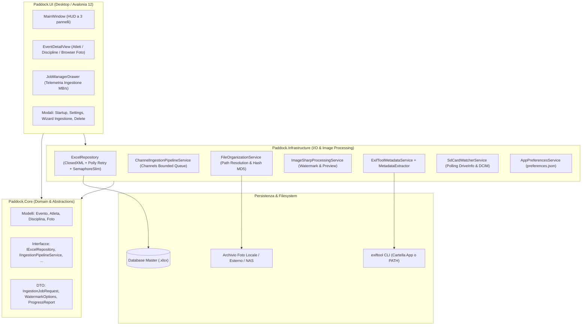
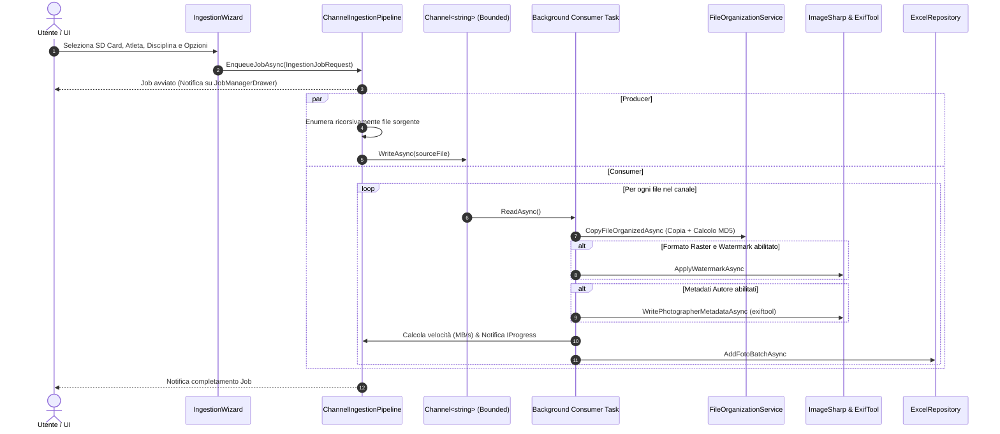

# Paddock

Applicazione desktop cross-platform ad alte prestazioni (.NET 10 + Avalonia UI) per fotografi professionisti di eventi sportivi, progettata per l'ingestione parallela da schede SD multiple, l'organizzazione automatizzata dei file per Atleta e Disciplina, l'applicazione di watermark e firme nei metadati (JPEG e RAW) e la persistenza dei dati sincronizzata su singolo foglio di calcolo Excel (`.xlsx`).

---

## Panoramica

Durante eventi sportivi sul campo (gare podistiche, ciclismo, rally, triathlon), i fotografi necessitano di scaricare contemporaneamente centinaia di gigabyte di scatti da molteplici corpi macchina e lettori di schede SD, catalogando rapidamente ogni foto per partecipante e disciplina sportiva prima della consegna o pubblicazione.

I software di catalogazione convenzionali risultano spesso rigidi, impongono formati di catalogo proprietari difficilmente condivisibili e bloccano l'interfaccia utente durante i trasferimenti massivi di file.

**Paddock** risolve queste criticità offrendo:
- Un'architettura di ingestione concorrente non bloccante basata su code ad alte prestazioni (`System.Threading.Channels`), capace di gestire più schede SD in parallelo senza congelare la UI.
- Un'organizzazione fisica su disco standardizzata e deterministica, con separazione automatica tra formati raster (`Jpeg`) e negativi digitali proprietari (`Raw`).
- Un database trasparente e portabile basato su un singolo file Microsoft Excel (`.xlsx`), compatibile con cartelle sincronizzate su Google Drive, Dropbox e OneDrive.
- Iniezione metadati sicura di autore e copyright anche sui file RAW proprietari (senza alterare i dati di scatto) e applicazione opzionale di watermark grafico o testuale su file JPEG/PNG.

---

## Funzionalità

- **Ingestione Concorrente Multi-Card (Producer/Consumer)**: Esecuzione simultanea di importazioni da percorsi o lettori SD multipli con monitoraggio di velocità di trasferimento (MB/s), percentuale di completamento, tempo residuo stimato e supporto alla cancellazione reattiva per singolo job.
- **Rilevamento Hardware Unità Rimovibili**: Servizio in background (`SdCardWatcherService`) che monitora il collegamento e lo scollegamento di unità esterne e rileva in automatico la presenza della directory standard fotografica `DCIM`.
- **Organizzazione Automatica su File System**:
  - Albero generato: `[Cartella Root] / [Nome Evento] / [Pettorale_Cognome_Nome] / [Disciplina] / [Jpeg | Raw] / [NomeFile]`
  - Riconoscimento automatico di 10 estensioni RAW fotografiche: `.CR2`, `.CR3`, `.NEF`, `.ARW`, `.DNG`, `.RAF`, `.RW2`, `.ORF`, `.PEF`, `.SRW`.
  - Sanitizzazione automatica dei caratteri non consentiti nei percorsi di sistema (con fallback a `Generale` o `Atleta_Sconosciuto`).
  - Verifica di integrità tramite calcolo hash MD5 per ciascun file copiato.
- **Portabilità del Database e Percorsi Relativi**:
  - Il foglio Excel registra percorsi relativi standardizzati (`[NomeEvento]\[Atleta]\[Disciplina]\[Formato]\[NomeFile]`), rendendo l'archivio indipendente da lettere di unità o percorsi assoluti.
  - Cartella radice globale (`BasePath`) centralizzata nel foglio `Impostazioni`, con funzione di aggiornamento batch di tutti gli eventi in caso di cambio computer o spostamento su storage esterno/NAS.
- **Database Excel Resiliente con Gestione Conflitti I/O**:
  - Persistenza su singolo file `.xlsx` gestita tramite `ClosedXML`.
  - Meccanismo di lock thread-safe (`SemaphoreSlim`) e policy di retry automatico con backoff esponenziale (`Polly`) contro i lock temporanei causati da Microsoft Excel o client di sincronizzazione cloud.
  - Notifica non-bloccante nella barra superiore della UI in caso di contesa di accesso prolungata.
- **Database Intercambiabili & Wizard di Avvio**: Possibilità di selezionare un database esistente, crearne uno nuovo da template a 5 fogli o continuare dall'ultimo file utilizzato, con cronologia dei file recenti salvata in `%APPDATA%\Paddock\preferences.json`.
- **Watermark Engine Personalizzabile**: Applicazione di watermark tramite `SixLabors.ImageSharp` su formati raster (`.jpg`, `.jpeg`, `.png`, `.bmp`, `.webp`): logo PNG con ridimensionamento proporzionale calcolato tra il 5% e l'80% dell'immagine, opacità regolabile (0-100%) e posizionamento controllato (angoli, centro).
- **Pipeline Metadati Ibrida (JPEG + RAW)**:
  - Scrittura sicura dei campi Autore (*Artist/Creator*) e Copyright su file JPEG e RAW proprietari tramite wrapper del processo `exiftool` con parametro `-overwrite_original`.
  - Risoluzione intelligente dell'eseguibile `exiftool` su 3 livelli: percorso personalizzato, cartella dell'applicazione locale o variabile di ambiente `PATH`.
  - Estrazione istantanea della data di scatto tramite `MetadataExtractor` con fallback su metadati di filesystem.
- **Eliminazione Sicura a 3 Vie**: Finestra modale vincolante per l'eliminazione di un evento con opzioni esplicite: eliminazione del solo record su Excel, cancellazione sia dal database sia dei file fisici dal disco (con checkbox di sicurezza obbligatoria) o annullamento.
- **Interfaccia Utente "Pro Darkroom"**: GUI Avalonia UI a tema scuro a basso contrasto (`#121316`, `#16181C`, `#22252B`), accenti arancio studio (`#FF8C32`) e ciano (`#00B4D8`), layout HUD a 3 pannelli e cassetto a scomparsa per il Job Manager.

---

## Architettura

Il progetto implementa i principi di **Clean Architecture** e il pattern **MVVM** (`CommunityToolkit.Mvvm`), suddiviso in 4 progetti:



### Flusso Dati di Ingestione (System.Threading.Channels)



---

## Tech Stack

| Componente | Tecnologia | Versione | Utilizzo nel Progetto |
|---|---|---|---|
| **Runtime & SDK** | .NET | `10.0` (C# 14) | Runtime di esecuzione e compilazione della soluzione |
| **Framework GUI** | Avalonia UI | `12.1.3` | Interfaccia grafica multipiattaforma desktop XAML |
| **GUI Theme & Fonts** | Avalonia.Themes.Fluent / Inter | `12.1.3` | Stile Fluent e tipografia Inter |
| **Strumenti Diagnostici UI** | AvaloniaUI.DiagnosticsSupport | `2.2.3` | Ispezione e DevTools XAML (attivo in build Debug) |
| **MVVM Toolkit** | CommunityToolkit.Mvvm | `8.4.0` | Source generators (`[ObservableProperty]`, `[RelayCommand]`) |
| **Manipolazione Excel** | ClosedXML | `0.105.1` | Lettura e scrittura nativa OpenXML su file `.xlsx` |
| **Resilienza I/O** | Polly | `8.5.2` | Policy di retry esponenziale per lock concorrenti su file |
| **Image Processing** | SixLabors.ImageSharp | `3.1.7` | Decodifica, ridimensionamento e rendering watermark raster |
| **Image Drawing** | SixLabors.ImageSharp.Drawing | `2.1.5` | Rendering vettoriale e posizionamento watermark |
| **Lettura Metadati** | MetadataExtractor | `2.9.3` | Parsing rapido EXIF/TIFF per estrazione data di scatto |
| **Scrittura Metadati RAW** | ExifTool CLI | Esterno / PATH / AppDir | Wrapper di processo per scrittura metadati su RAW proprietari |
| **Framework di Test** | xUnit | `2.9.3` | Test runner e framework di unit/integration testing |
| **Asserzioni Test** | FluentAssertions | `6.12.2` | Asserzioni fluide e leggibili per i test |
| **Mocking** | Moq | `4.20.72` | Mocking delle interfacce di servizio nei test |
| **Coverage Collector** | coverlet.collector | `6.0.4` | Raccolta telemetria di copertura del codice |

---

## Prerequisiti

1. **.NET 10 SDK** (versione `10.0.100` o successiva). Verificare l'installazione tramite:
   ```bash
   dotnet --version
   ```
2. **Sistema Operativo**:
   - **Windows**: Windows 10 (versione 1809+) o Windows 11 (x64 / arm64).
   - **Linux**: Distribuzione Linux a 64-bit con X11 o Wayland e supporto a librerie X11/FontConfig (es. Ubuntu 22.04+, Fedora 38+).
3. **ExifTool (Opzionale ma Raccomandato)**:
   - Necessario per iniettare i campi Autore e Copyright nei file **RAW** proprietari (`.CR2`, `.CR3`, `.NEF`, `.ARW`, `.DNG`, `.RAF`, `.RW2`, `.ORF`, `.PEF`, `.SRW`).
   - Scaricabile dal sito ufficiale: è sufficiente posizionare l'eseguibile (`exiftool.exe` su Windows o `exiftool` su Linux) direttamente nella cartella dell'applicazione accanto a `Paddock.UI.exe`, oppure aggiungerlo al `PATH` di sistema. In assenza di ExifTool, l'ingestione procede regolarmente notificando l'utente ed evitando qualsiasi rischio di corruzione dei file.

---

## Installazione

1. Clonare il repository:
   ```bash
   git clone <URL_DEL_REPOSITORY>
   cd PhotoOrganizer
   ```

2. Ripristinare i pacchetti NuGet per l'intera soluzione:
   ```bash
   dotnet restore Paddock.slnx
   ```

---

## Configurazione

L'applicazione non richiede variabili d'ambiente server o file `.env`. Le configurazioni sono gestite tramite due canali:

### 1. File di Preferenze Applicazione (`preferences.json`)

Il file memorizza lo stato dell'ambiente locale del client e viene salvato nel percorso:
- **Windows**: `%APPDATA%\Paddock\preferences.json`
- **Linux**: `~/.config/Paddock/preferences.json`

| Proprietà | Tipo | Descrizione | Valore di Default |
|---|---|---|---|
| `LastDatabasePath` | `string?` | Percorso assoluto dell'ultimo database `.xlsx` aperto | `null` (al primo avvio ricade su `%USERPROFILE%\Documents\Paddock\Paddock_Database.xlsx`) |
| `RecentDatabases` | `string[]` | Elenco storico dei percorsi dei database aperti di recente (fino a 10) | `[]` |
| `AutoOpenLastDatabase` | `boolean` | Se `true`, salta il dialogo di avvio e carica direttamente l'ultimo database | `false` |

### 2. Foglio di Configurazione nel Database Excel (`Impostazioni`)

Ogni database `.xlsx` contiene una scheda dedicata denominata `Impostazioni`:

| Chiave | Valore Esempio | Descrizione |
|---|---|---|
| `BasePath` | `C:\Users\...\Pictures\Paddock` | Percorso radice base sul filesystem per l'archivio foto |
| `VersioneSchema` | `1.0` | Versione strutturale dello schema delle tabelle |

Inoltre, durante la creazione di un nuovo evento, la cartella di destinazione predefinita proposta è configurata su:
`%USERPROFILE%\Pictures\Paddock_Events`

---

## Avvio in Locale

### Avvio da riga di comando (CLI)

Dalla cartella principale del repository:

```bash
dotnet run --project src/Paddock.UI/Paddock.UI.csproj
```

### Avvio da Visual Studio Code o Visual Studio

- **Visual Studio Code**: Aprire la cartella del progetto (la configurazione è già definita in `.vscode/settings.json` per puntare a `Paddock.slnx`) e avviare il debug con `F5`.
- **Visual Studio 2022 (v17.12+) / JetBrains Rider**: Aprire la soluzione `Paddock.slnx`, impostare `Paddock.UI` come progetto di avvio ed eseguire in modalità Debug.

---

## Utilizzo

### 1. Selezione o Creazione del Database
All'avvio compare la schermata di selezione:
- **Continua con l'ultimo database**: Apre direttamente il file `.xlsx` impostato.
- **Nuovo Archivio**: Consente di salvare un nuovo file Excel preformattato a 5 schede.
- **Apri Esistente**: Collega un database già esistente (es. condiviso su Google Drive / Dropbox).

### 2. Gestione Eventi, Atleti e Discipline
1. Fare clic su **+ Nuovo** nella barra laterale sinistra per registrare un nuovo evento sportivo (Nome, Date, Luogo, Cartella Root di destinazione).
2. Selezionare l'evento per accedere al workspace centrale:
   - **Scheda Atleti**: Censire i concorrenti con Numero di Pettorale, Cognome, Nome e Categoria.
   - **Scheda Discipline**: Definire le discipline dell'evento (es. *Nuoto*, *Ciclismo*, *Corsa*, *Podio*).
   - **Scheda Browser Foto**: Visualizzare l'elenco degli scatti già archiviati con filtro rapido (`TUTTI`, `JPEG`, `RAW`).

### 3. Ingestione da Schede SD
1. Premere il pulsante **⚡ Ingestione SD** nella schermata dell'evento.
2. Nella finestra modale:
   - Selezionare l'unità rimovibile rilevata in automatico o sfogliare una cartella di origine.
   - Associare l'**Atleta** e la **Disciplina** di destinazione.
   - (Opzionale) Attivare il **Watermark** scegliendo immagine PNG, opacità e posizione.
   - (Opzionale) Configurare i metadati con **Nome Fotografo** e **Avviso Copyright**.
3. Premere **Avvia Ingestione**: il lavoro viene accodato e il cassetto inferiore **Job Manager** si apre automaticamente mostrando progresso, file elaborati e velocità in MB/s.

### 4. Spostamento Libreria o Cambio Computer
In caso di migrazione su un nuovo disco, lettera di unità differente o nuovo computer:
1. Aprire **⚙ Impostazioni** dall'header dell'applicazione.
2. Inserire il nuovo percorso radice nel campo **BasePath Archivio Foto**.
3. Fare clic su **Aggiorna BasePath nel Database Excel**: Paddock aggiornerà in modo atomico il foglio `Impostazioni` e sincronizzerà la colonna `CartellaDestinazioneRoot` di tutti gli eventi registrati.

---

## API

Non applicabile. **Paddock** è un'applicazione desktop standalone per uso locale e non espone endpoint di rete o servizi Web API REST.

---

## Database

La persistenza risiede interamente all'interno di un file Microsoft Excel OpenXML (`.xlsx`), inizializzato e gestito da `ClosedXML`.

All'avvio, `EnsureDatabaseInitializedAsync` verifica la presenza dei 5 fogli di calcolo obbligatori e ne genera le intestazioni se mancanti:

### 1. Foglio `Eventi`
| Colonna | Tipo | Descrizione |
|---|---|---|
| `Id` | `Guid` | Identificativo univoco dell'evento |
| `NomeEvento` | `string` | Denominazione dell'evento sportivo |
| `DataInizio` | `DateTime` | Data inizio competizione |
| `DataFine` | `DateTime` | Data fine competizione |
| `Luogo` | `string` | Città o località dell'evento |
| `CartellaDestinazioneRoot` | `string` | Percorso radice di destinazione su disco |
| `Note` | `string?` | Note opzionali sull'evento |

### 2. Foglio `Discipline`
| Colonna | Tipo | Descrizione |
|---|---|---|
| `Id` | `Guid` | Identificativo univoco della disciplina |
| `EventoId` | `Guid` | Chiave esterna dell'evento correlato |
| `NomeDisciplina` | `string` | Nome della specialità o disciplina |
| `Descrizione` | `string?` | Descrizione aggiuntiva |

### 3. Foglio `Atleti`
| Colonna | Tipo | Descrizione |
|---|---|---|
| `Id` | `Guid` | Identificativo univoco dell'atleta |
| `EventoId` | `Guid` | Chiave esterna dell'evento correlato |
| `NumeroPettorale` | `string` | Pettorale di gara |
| `Nome` | `string` | Nome dell'atleta |
| `Cognome` | `string` | Cognome dell'atleta |
| `Categoria` | `string?` | Categoria di gara (es. Master, Elite) |
| `Note` | `string?` | Note o dati di contatto |

### 4. Foglio `Foto`
| Colonna | Tipo | Descrizione |
|---|---|---|
| `Id` | `Guid` | Identificativo univoco dello scatto |
| `EventoId` | `Guid` | Riferimento all'evento |
| `AtletaId` | `Guid` | Riferimento all'atleta |
| `DisciplinaId` | `Guid` | Riferimento alla disciplina |
| `NomeFileOriginale` | `string` | Nome del file originale sulla fotocamera |
| `PathRelativo` | `string` | Percorso relativo rispetto al BasePath (`Evento\Atleta\Disciplina\Formato\File`) |
| `Formato` | `string` | Valore: `JPEG` oppure `RAW` |
| `DataScatto` | `DateTime?` | Data e ora dello scatto estratta da EXIF |
| `Fotografo` | `string?` | Nome dell'autore iniettato nei metadati |
| `WatermarkApplicato` | `boolean` | `True` se è stato applicato watermark grafico |
| `DimensioneByte` | `long` | Dimensione in byte del file |
| `HashMd5` | `string?` | Checksum MD5 per verifica di integrità |

### 5. Foglio `Impostazioni`
| Colonna | Tipo | Descrizione |
|---|---|---|
| `Chiave` | `string` | Identificativo dell'impostazione (es. `BasePath`, `VersioneSchema`) |
| `Valore` | `string` | Valore configurato |
| `Descrizione` | `string?` | Descrizione del parametro |

---

## Compilazione e Build

### Compilazione Debug (Standard)
```bash
dotnet build Paddock.slnx
```

### Compilazione Release Ottimizzata
```bash
dotnet build Paddock.slnx -c Release
```

### Pubblicazione Eseguibile Standalone (Self-Contained)

Per Windows x64:
```bash
dotnet publish src/Paddock.UI/Paddock.UI.csproj -c Release -r win-x64 --self-contained -p:PublishSingleFile=true
```

Per Linux x64:
```bash
dotnet publish src/Paddock.UI/Paddock.UI.csproj -c Release -r linux-x64 --self-contained -p:PublishSingleFile=true
```

L'output compilato sarà disponibile in `src/Paddock.UI/bin/Release/net10.0/<runtime>/publish/`.

---

## Test

Il progetto include una suite completa di test unitari e di integrazione basati su **xUnit**, **FluentAssertions** e **Moq**.

### Esecuzione di tutti i test
```bash
dotnet test Paddock.slnx
```

Output atteso:
```text
Passed!  - Failed:     0, Passed:    24, Skipped:     0, Total:    24
```

### Suddivisione della Suite di Test
La suite include 24 casi di test così ripartiti:
- `ExcelRepositoryTests` (4 test): Inizializzazione 5 fogli, operazioni CRUD in cascata, gestione concorrenza multi-thread e aggiornamento atomico del BasePath.
- `ChannelIngestionPipelineTests` (2 test): Elaborazione parallela end-to-end con batching su Excel e cancellazione reattiva dei job tramite CancellationToken.
- `FileOrganizationServiceTests` (11 test: 9 casi teoria estensioni + 2 test): Riconoscimento estensioni RAW e raster, generazione alberatura delle directory e copia con calcolo hash MD5.
- `ViewModelTests` (7 test): Validazione modale eliminazione a 3 vie (sicura e forzata), creazione evento, wizard di ingestione, impostazioni, avvio database e risorsa incorporata del logo.

### Esecuzione con filtro per specifica suite
- **Test del Repository Excel e Concorrenza**:
  ```bash
  dotnet test Paddock.slnx --filter "FullyQualifiedName~ExcelRepositoryTests"
  ```
- **Test della Pipeline di Ingestione su Canali**:
  ```bash
  dotnet test Paddock.slnx --filter "FullyQualifiedName~ChannelIngestionPipelineTests"
  ```
- **Test di Organizzazione Cartelle e RAW Detection**:
  ```bash
  dotnet test Paddock.slnx --filter "FullyQualifiedName~FileOrganizationServiceTests"
  ```
- **Test dei ViewModel e Validazione Modali**:
  ```bash
  dotnet test Paddock.slnx --filter "FullyQualifiedName~ViewModelTests"
  ```

### Esecuzione in modalità Watch
Durante lo sviluppo, per rieseguire automaticamente i test a ogni salvataggio:
```bash
dotnet watch test --project tests/Paddock.Tests/Paddock.Tests.csproj
```

---

## Linting e Formattazione

Il codice rispetta le convenzioni di stile C# 14 / .NET 10. Per formattare automaticamente l'intera soluzione:

```bash
dotnet format Paddock.slnx
```

Per verificare la formattazione senza applicare modifiche:
```bash
dotnet format Paddock.slnx --verify-no-changes
```

---

## Docker

Non applicabile. Il progetto è un'applicazione desktop client interattiva basata su interfaccia grafica Avalonia UI e non include immagini o configurazioni Docker nel repository.

---

## Release

Il processo di release e distribuzione dei pacchetti per gli utenti finali è gestito tramite **GitHub Actions** ed è configurato per essere eseguito **esclusivamente in modalità manuale** (`workflow_dispatch`).

> [!NOTE]
> Il normale flusso di lavoro Git (`git commit` e `git push`) **non esegue test automatici** né attiva pipeline di rilascio, garantendo il pieno controllo operativo sulle versioni distribuite.

### 1. Workflow GitHub Actions (`.github/workflows/release.yml`)

La workflow è definita in [`.github/workflows/release.yml`](file:///.github/workflows/release.yml) e utilizza runner ufficiali isolati:
- **Runner Windows** (`windows-latest`): compila l'applicazione tramite [`scripts/build-windows.ps1`](file:///scripts/build-windows.ps1) e produce il pacchetto completo per Windows x64.
- **Runner Linux** (`ubuntu-latest`): compila l'applicazione tramite [`scripts/build-linux.sh`](file:///scripts/build-linux.sh), assegna i corretti permessi di esecuzione POSIX (`chmod +x`) e produce il pacchetto completo per Linux x64.

### 2. Come Avviare Manualmente la Release su GitHub

1. Accedere al repository su GitHub.
2. Navigare nella scheda **Actions** dalla barra superiore.
3. Selezionare la workflow **Release** nell'elenco a sinistra.
4. Fare clic sul menu a tendina **Run workflow** sulla destra.
5. (Opzionale) Specificare il tag di versione nel campo `version` (es. `1.0.0`, default: `1.0.0`).
6. Premere il pulsante verde **Run workflow**.

Al termine della compilazione, nella pagina della run saranno disponibili per il download **due artifact distinti**:
- **`Paddock-<versione>-windows-x64.zip`**: archivio standalone per Windows x64. Contiene `Paddock.UI.exe` e tutte le librerie native necessarie (`libSkiaSharp.dll`, `libHarfBuzzSharp.dll`, `av_libglesv2.dll`). Non richiede l'installazione preliminare del runtime .NET.
- **`Paddock-<versione>-linux-x64.zip`**: archivio standalone per distribuzioni Linux x64. Contiene l'eseguibile ELF `Paddock.UI` e le librerie native `.so`.

### 3. Packaging Locale

È possibile generare gli stessi identici pacchetti distribuibili anche localmente utilizzando gli script dedicati:

- **Su Windows (PowerShell)**:
  ```powershell
  ./scripts/build-windows.ps1 -Version "1.0.0"
  ```
  Genera: `artifacts/Paddock-1.0.0-windows-x64.zip`

- **Su Linux (Bash)**:
  ```bash
  chmod +x ./scripts/build-linux.sh
  ./scripts/build-linux.sh "1.0.0"
  ```
  Genera: `artifacts/Paddock-1.0.0-linux-x64.zip`

---

## Struttura del Progetto

```text
PhotoOrganizer/
├── .github/
│   └── workflows/
│       └── release.yml           # Workflow GitHub Actions per release manuale (workflow_dispatch)
├── .vscode/
│   └── settings.json             # Configurazione VS Code (dotnet.defaultSolution: Paddock.slnx)
├── scripts/
│   ├── build-windows.ps1         # Script packaging self-contained per Windows (win-x64)
│   └── build-linux.sh            # Script packaging self-contained per Linux (linux-x64)
├── src/
│   ├── Paddock.Core/             # Dominio puro e astrazioni (Nessuna dipendenza esterna I/O)
│   │   ├── DTOs/                 # DTO per Ingestione, Watermark e Metadati
│   │   ├── Enums/                # FormatoFoto, WatermarkPosition, IngestionStatus, DeleteMode
│   │   ├── Interfaces/           # Interfacce di servizio (IExcelRepository, IIngestionPipeline, ...)
│   │   ├── Models/               # Modelli di dominio (Evento, Disciplina, Atleta, Foto)
│   │   └── Paddock.Core.csproj
│   │
│   ├── Paddock.Infrastructure/   # Implementazione servizi di persistenza, hardware e processing
│   │   ├── Configuration/        # Gestione preferenze locali (AppPreferencesService)
│   │   ├── Excel/                # Repository ClosedXML con retry Polly e SemaphoreSlim
│   │   ├── Hardware/             # Rilevamento rimovibili SD / DCIM (SdCardWatcherService)
│   │   ├── ImageProcessing/      # Watermark e rendering miniature (ImageSharp)
│   │   ├── Ingestion/            # Pipeline asincrona su System.Threading.Channels
│   │   ├── Metadata/             # Wrapper ExifTool e parsing MetadataExtractor
│   │   ├── Storage/              # Strutturazione cartelle e calcolo checksum MD5
│   │   └── Paddock.Infrastructure.csproj
│   │
│   └── Paddock.UI/               # Interfaccia grafica Avalonia Desktop (MVVM)
│       ├── Assets/               # Risorsa incorporata logo.jpg (Icona finestra e brand)
│       ├── Converters/           # ValueConverters XAML per la UI
│       ├── ViewModels/           # ViewModels CommunityToolkit.Mvvm (Main, EventDetail, JobManager, Dialoghi)
│       ├── Views/                # Controlli e finestre XAML Avalonia
│       ├── App.axaml             # Risorse globali, stili Darkroom e palette colori
│       ├── app.manifest          # Manifest per compatibilità Windows
│       ├── MainWindow.axaml      # Finestra principale con layout HUD a 3 pannelli
│       ├── Program.cs            # Entry point dell'applicazione Avalonia
│       └── Paddock.UI.csproj
│
├── tests/
│   └── Paddock.Tests/            # Suite di test xUnit (24 test unitari e di integrazione)
│       ├── ChannelIngestionPipelineTests.cs
│       ├── ExcelRepositoryTests.cs
│       ├── FileOrganizationServiceTests.cs
│       ├── ViewModelTests.cs
│       └── Paddock.Tests.csproj
│
├── .gitignore                    # Regole di esclusione Git per .NET 10, build ed OS
├── logo.jpg                      # Immagine master del logo ufficiale
├── Paddock.slnx                  # Soluzione moderna XML di .NET 10
└── README.md                     # Documentazione tecnica del progetto
```

---

## Risoluzione dei Problemi

### 1. File Excel Bloccato da un'Altra Applicazione (`LockContention`)
- **Causa**: Il file `.xlsx` è aperto in Microsoft Excel in modalità esclusiva o è temporaneamente bloccato dal client di sincronizzazione Google Drive / OneDrive.
- **Comportamento dell'applicazione**: Paddock esegue fino a 5 tentativi di accesso con backoff esponenziale tramite `Polly`. Se il file rimane bloccato, compare un banner giallo/arancio non bloccante nella barra superiore che avvisa della contesa senza far arrestare il programma.
- **Risoluzione**: Chiudere il file in Microsoft Excel o attendere il completamento della sincronizzazione cloud prima di ritentare.

### 2. Metadati Autore non Scritti sui File RAW Proprietari
- **Causa**: `exiftool` non è installato nel sistema né presente nella directory dell'applicazione.
- **Risoluzione**:
  - Scaricare l'eseguibile di ExifTool e collocarlo direttamente nella cartella dell'eseguibile di Paddock (`exiftool.exe` su Windows o `exiftool` su Linux), oppure aggiungerlo al `PATH` di sistema.
  - Verificare da riga di comando che digitando `exiftool` l'utility risponda correttamente.
  - Sui file JPEG, se ExifTool non è disponibile, la catalogazione procede comunque memorizzando autore e copyright nel database Excel.

### 3. "BasePath non Trovato" o Lettera di Unità Modificata
- **Causa**: L'archivio delle foto risiede su un disco esterno o pendrive che ha cambiato lettera di unità (es. da `D:\` a `E:\`) o è stato spostato su un altro PC.
- **Risoluzione**:
  - Aprire la finestra **⚙ Impostazioni** in Paddock.
  - Modificare il campo **BasePath Archivio Foto** con il nuovo percorso radice.
  - Premere **Aggiorna BasePath nel Database Excel**: la modifica aggiornerà sia la configurazione che tutti i percorsi dell'evento nel database in un'unica operazione atomica.

---

## Sviluppo e Linee Guida

- **Separazione dei Compiti**: Il progetto `Paddock.Core` non deve mai contenere dipendenze verso `Paddock.Infrastructure` o `Paddock.UI`.
- **Operazioni I/O Non Bloccanti**: Tutte le operazioni di scrittura e copia file devono passare attraverso `System.Threading.Channels` o metodi asincroni che accettano un `CancellationToken`. Nessuna operazione di lettura/scrittura sincrona su file deve essere eseguita sul thread della UI.
- **Isolamento dei Test**: I test in `Paddock.Tests` operano su directory temporanee create dinamicamente tramite `Path.GetTempPath()` e ripulite con il pattern `IDisposable` al termine di ogni esecuzione.

---

## Licenza

Non specificata. Consultare l'autore o il proprietario del repository per informazioni relative ai diritti di utilizzo e distribuzione.

---

## Documentazione e Risorse Esterne

- [Documentazione Avalonia UI](https://docs.avaloniaui.net/)
- [ClosedXML GitHub & Guide](https://github.com/ClosedXML/ClosedXML)
- [SixLabors ImageSharp Documentation](https://docs.sixlabors.com/)
- [ExifTool by Phil Harvey](https://exiftool.org/)
- [CommunityToolkit.Mvvm Documentation](https://learn.microsoft.com/dotnet/communitytoolkit/mvvm/)
